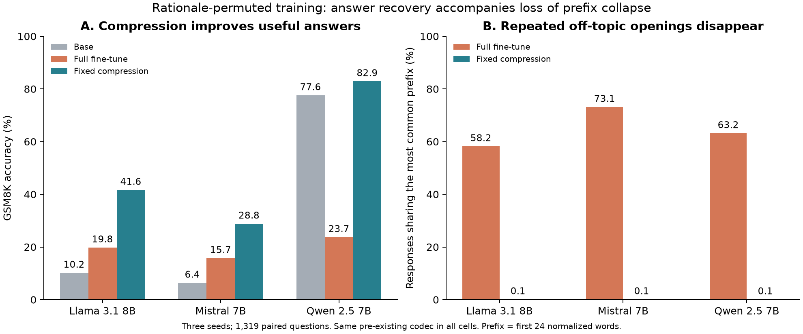

The strongest current direction is **how compression separates useful adaptation from the generation behavior that fine-tuning also teaches**. F03 has a large effect across three model families and an unexpected pattern in the actual outputs. I would put it ahead of another attempt to fit a universal budget predictor.

This review uses results pulled from Jean-Zay through 8 September, about 01:22 UTC, plus the earlier completed common F03 predictions. F01 has 45/45 result files; F10 has 30; F11 has 228/240 cells. Parts of the natural-task codec campaign are still running. [Numerical audit](new_run_analysis.json) · [Pulled artifacts](new_run_results/) · [Figure](results_review.png). No training code or live jobs changed during this review.

**1. F03/F05: preserving a fine-tune can preserve behavior that impairs the task.**

Use the same existing compression intervention in all nine rationale-permuted adapters, without choosing each model's best test rung:

| GSM8K accuracy, mean of three seeds | Base | Full fine-tune | Fixed compression |
|---|---:|---:|---:|
| Llama 3.1 8B | 10.2% | 19.8% | 41.6% |
| Mistral 7B | 6.4% | 15.7% | 28.8% |
| Qwen 2.5 7B | 77.6% | 23.7% | 82.9% |

The new finding is the form of the damage. After the full fine-tune, **58%, 73%, and 63%** of responses share their model/seed's most common 24-word opening, usually an off-topic arithmetic rationale. After compression, that share is about **0.1%**. The 12- and 48-word checks agree qualitatively. Training permutes rationale bodies while preserving each question and its correct final answer; it does not train on a single repeated rationale. The collapse emerges during generation.

For example, on GSM8K test-10, the Llama adapter discusses unrelated clothing purchases. The compressed adapter correctly derives 60 + 180 + 126 = 366 downloads. Across all question/seed pairs, compression gets an answer right that **both the base and full adapter got wrong** in 27.6% of Llama cases, 21.4% of Mistral cases, and 9.4% of Qwen cases. This rules out a literal return to the base model's answer behavior. It does not establish acquisition of new knowledge: compression may elicit competence already present in the receiver.

Each comparison pairs all 1,319 question IDs. Question-clustered bootstrap intervals for the accuracy gain over the full adapter are +19.3–24.4, +10.7–15.4, and +56.7–61.6 percentage points, respectively. These intervals condition on the three observed training seeds.

The files occupy 2.63–2.75 MB and retain only 60–67% of the fine-tune's held-out likelihood gain. F05 supplies the converse warning: for Gemma 2 9B base on code, the cheapest measured files retaining at least 90% of that likelihood gain retain only **33–45% of the HumanEval improvement**. Here SFT likelihood and HumanEval use different distributions, so distribution shift remains part of the explanation.

**Paper thesis to test:** a rate target tied to imitating the finished adapter can price input-ignoring behavior, while a smaller correction supports more useful input-dependent computation. Prefix diversity is descriptive evidence, not a mutual-information estimator or a causal mechanism.

**Decisive next test:** on the existing adapters, compare scalar adapter rescaling, random rank removal, and informed rank truncation. Match the intervention strength on a development set. Perturb the numbers or relations in each question and measure whether the derivation and answer change correctly. Include aligned-rationale controls. If rescaling reproduces the recovery and conditioning change, the result concerns suppression of a harmful learned output policy; do not claim selective spectral removal. If only informed removal works after strength matching, selective removal becomes a stronger mechanism. Initial estimate: 20–50 H100-hours using saved adapters; measure throughput before expanding.

For a functional rate, fix the receiver, public decoder, query distribution, and an absolute task-quality target. Count the shortest actual message passing that target. Separately measure fidelity to the finished adapter on the same queries. The two feasible code sets need not contain one another, so their budgets need not agree. Current codec points are upper bounds within a restricted code family, not parameterization-free minimum description lengths.

Novelty must come from the causal loss and restoration of input conditioning, and its consequence for the rate target. Compression improving LoRA is already covered by [LoRA-Squeeze](https://arxiv.org/abs/2602.10993); inference-time rescaling also restores damaged performance in [recent audio QA work](https://arxiv.org/abs/2608.23092).

**2. F07/F14: the cost of storing an optimizer's solution can exceed the cost of achieving comparable behavior.**

On XBRL, directly trained rank 1 reaches 83.0%/83.8% accuracy on Mistral/Qwen, versus 83.4%/84.4% at rank 16. Its smallest measured files passing the likelihood criterion are 427,843/402,891 bytes. Completed informed recoding of the rank-64 adapters, across 84 rank/precision cells each, reaches 3,200,626/1,021,342 bytes: still about 7.5×/2.5× larger.

This motivates studying **excess code cost caused by the learned implementation**. It does not yet measure that excess cleanly. Mistral rank 64 also performs worse; rank-dependent optimization changes because alpha stays fixed at 32; equal aggregate accuracy does not imply equal corrections. Rank 1 already works, so the observed range contains no representability threshold.

Next, compare direct low-rank training and recoded high-rank training under a common absolute quality target, with per-question disagreement, the same coder, and matched rank scaling. If the gap disappears, the previous budget difference was an optimization/codec effect. If it survives matched functional fidelity, this becomes a strong explanation of why receiver/task scalars misprice adapter files. LoRA-Squeeze is the closest method baseline; rank compression itself is not the contribution.

**3. F10, informed by F11: distinguish discovering a rule from paying to store a learned mapping.**

For the p16 family at 512 taught mappings, Qwen learns the training mappings perfectly both with and without the prototype cue. Unseen accuracy changes from **8.7% to 100%**, while the measured storage changes only from **8.73 to 7.96 MB**. Rule reuse and stored-file size can move very differently. The cue changes the receiver's input, and the rate target scores taught mappings; this does not establish equal description length of the full functions. F01/F10 overlap, so they are not independent replications.

F11 adds a useful boundary: targeted examples beat the registered controls in **0/20** completed comparisons. The diagnostic program preference predicts the ambiguous-data fine-tune's dominant program in 19/24 base arms; five mismatches explain part of the failure, but targeting also loses when the diagnostic is right. The learned outputs still agree with their best single candidate program by 88.3% on average. This supports investigating how optimization selects among compatible programs, while rejecting the current targeting rule. The library-size, payload-size, and serialized-rate axes were not implemented, so the claimed identity-versus-payload experiment remains untested.

I would keep this third until the first two directions have decisive controls. F01's likelihood gate even accepts rank-64 p16 runs with only 8–15% training accuracy. F02's twelve new seed-fork fronts are not yet scored; agreeing forecasts would in any case need to be accurate, not merely agree. F09 has a lock but no completed path result; F12's separate-task arms do not measure joint correction cost. None currently establishes a scaling law.

For the next headline claim, freeze the distortion, coder search, intervention strength, and exclusions on development data; then test new tasks and a reserved model family. Preserve the current observations as discovery evidence. Also repair the codec cache contract before expanding: existing codec files with missing task scores are reused even when the new request asks for task evaluation. A cached file is not evidence that the requested comparison completed.
