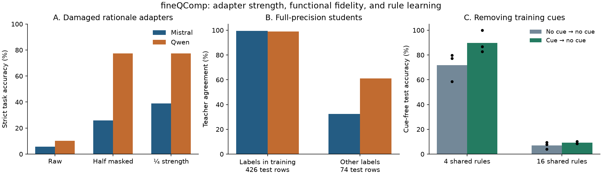

All 68 fineQComp cells from September 9 completed: 12 correction-conditioning, 20 functional-recoding, and 36 rule-discovery cells. This review uses their raw predictions, saved inputs, and actual codec sizes. These are development findings; none establishes a prospective information scaling law.

**Best causal lead: adapter strength and the course of generation.** On permuted-rationale adapters, quarter strength raises strict held-out accuracy from 5.7% to 38.9% on Mistral and from 10.2% to 77.5% on Qwen. Half masking reaches 25.8% and 77.5%. The paired quarter-minus-mask effect is +13.1 points on Mistral (95% template-bootstrap interval 8.3–18.2), and 0.0 on Qwen (−2.6–2.9). Selective removal of stored information is therefore not needed to explain this recovery.

The answer-likelihood audit sharpens this: raw damaged adapters prefer the correct answer over a different numerical variant's answer in 68.2% of Mistral comparisons and 76.8% of Qwen comparisons. Mistral's mean correct-answer preference actually *falls* under quarter strength while free-generation accuracy rises. This forced-answer comparison does not prove usable knowledge or calibrated discrimination, but it rules out treating generation accuracy as a direct measure of input sensitivity. Prefix/suffix crossovers also show that switching after 64 bad tokens does not reliably rescue generation.

The next test fixes quarter strength in advance and crosses prefix/suffix strength at 8, 32, and 128 tokens, alongside a finer strength curve. It uses fresh numerical instances and both aligned/permuted controls. A switch-time interaction would locate when the harmful continuation takes hold. If strength alone explains everything, drop the stronger mechanism claim. Adapter activation by phase already has a close prior in [Rethinking LoRA Memory Through the Lens of KV Cache Compression](https://arxiv.org/abs/2606.05698); the new claim must concern damaged reasoning continuations, not merely turning an adapter on and off.

**Most important measurement fix: fidelity depends on the tested inputs.** The test set holds out 2023, not companies. In 74 of its 500 rows, the gold label is absent from the first 4,096 training rows. Across all 20 full-precision students, teacher agreement is 99.2% on the other 426 rows; 789/861 disagreements occur on those 74 rows. These repeated predictions are a descriptive aggregate, not 10,000 independent examples.

For example, Mistral's direct rank-1 student agrees with its teacher on 424/426 supported-label rows and 43/74 others. Both teacher and student answer all 74 latter rows incorrectly. Full-function fidelity thus prices agreement on wrong extrapolations as well as preservation of the learned task. This is not a reason to discard those rows. Report both quantities, with the exact identity

`D_all = 0.852 D_seen + 0.148 D_unseen`.

All 20 development-selected task codecs miss the fixed 80% test threshold; only one fidelity selection reaches 97%. The original prospective result has failed. The new audit reuses every saved student and scores the complete serialized frontier, preserving the original selections and adding label-support strata. Its test frontiers are descriptive, not a second prospective test. All 40 raw gauge controls agree exactly with the original student predictions.

**Higher-risk learning lead: cues can teach or substitute for a rule.** With four shared rules, cue-then-hidden training reaches 89.8% cue-free test accuracy versus 71.9% for hidden-then-hidden. With sixteen rules these become 9.1% and 7.0%, despite perfect accuracy on taught hidden inputs. Permanently cued models follow a wrong cue essentially perfectly. The follow-up crosses 4/8/16 rules with hidden→hidden, cue→hidden, and cue→mixed training. Mixed training shows every rule/item both with and without a cue. If it preserves unseen cue-free performance at higher complexity, it supports a learning-path effect; if not, the observed benefit remains limited to the easy sharing regime. Family transfer is still required for this claim.

| Branch | Next experiment | Full array |
|---|---|---|
| `research/correction-conditioning` | Strength × switch time; 8 cells | `1962482` |
| `research/functional-recoding` | Saved-checkpoint support/frontier audit; 20 cells | `1962489` |
| `research/rule-discovery` | Cue withdrawal versus mixed training; 27 cells | `1962410` |

The runnable commits and remote paths are in [the launch record](launch/next_2026_09_10.json). The first strength submission lacked saved aligned Llama controls and was replaced with the matched Mistral/Qwen panel. No existing unrelated jobs were cancelled. Numerical details: [conditioning](conditioning_audit_2026_09_10.json), [recoding support](recoding_support_audit_2026_09_10.json), [rule curricula](rule_curriculum_audit_2026_09_10.json). Bootstrap intervals resample templates after averaging the three numerical variants and three fixed adapter seeds; they do not measure uncertainty over model families.
