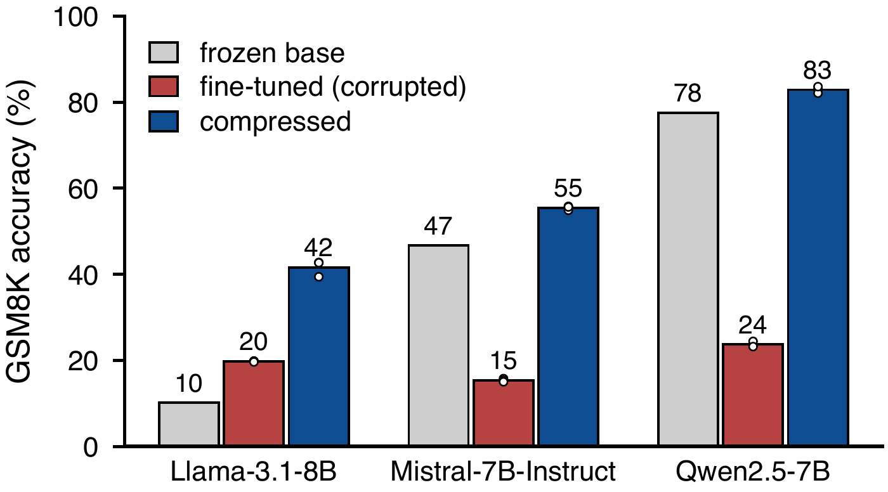

# fineQComp

<p align="center">Measure the bits needed to preserve a LoRA update's learned behavior.</p>

<p align="center"></p>

fineQComp studies how much of a trained adapter must survive compression to
keep its learned behavior. It measures rate from saved, reloaded adapter files,
tests recovery from corrupted training, and predicts the required rate from
the uncompressed update. The repo includes experiment configs, measured
results, and the paper's figure code.

## Quickstart

Install [uv](https://docs.astral.sh/uv/getting-started/installation/), then run
from this checkout with Python 3.11 or newer:

```bash
uv run scripts/reproduce.py
```

This command installs the locked dependencies, rebuilds the available figure
PDFs, PNG previews, and breadth table, and checks four rate-prediction reports
against the recorded scores. Outputs go to `.cache/reproduction/`; use
`--out DIR` to choose another folder. It runs on CPU using tracked measurements.
Fresh training and model evaluation need a Linux NVIDIA GPU host and model/data
downloads. The stored layer-location figure and intro diagram source are copied;
the local TeX predates the final submission.

See the [submission](paper/submission.pdf), [figure map](paper/README.md),
[results](results/), and [guide](docs/reproduce.md) for the evidence, repo layout,
and GPU experiments.
