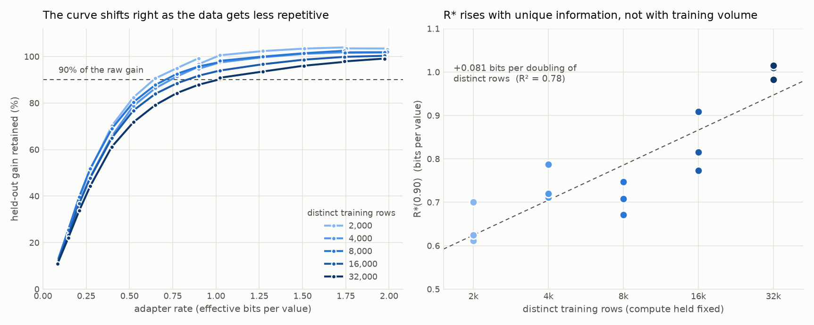

# The adapter bit budget tracks unique data, not training volume

**Result: positive.** Hold compute exactly fixed — 2,000 optimizer updates and
32,000 samples seen in every arm — and vary only how many of those samples are
distinct. The smallest adapter file that still holds 90% of the fine-tuning
gain, R\*(0.90), **rises from 0.65 bits per value at 2,000 distinct rows to 1.00
at 32,000**. Sixteen times the distinct data costs 55% more adapter bits.

`R* = -0.26 + 0.081 · log₂(distinct rows)`, R² = 0.78 over 15 cells. The extreme
arms do not overlap across seeds (2k: 0.611–0.700; 32k: 0.983–1.015).

Recorded 2026-08-21. Mistral-7B-v0.1 on an NF4 base, rank-16 LoRA on all linear
projections, MetaMathQA training, evaluated on all 1,319 GSM8K test problems
with greedy decoding, and on held-out bits over 256 MetaMathQA calibration rows.
Seeds 11/22/33.

## Headline numbers

Every arm sees the same 32,000 samples; the epoch count absorbs the difference.

| arm | distinct rows | epochs | R\*(0.90) bits axis | seed range | R\*(0.90) accuracy axis | raw GSM8K EM |
|---|---|---|---|---|---|---|
| e | 2,000 | 16 | **0.645** | 0.611–0.700 | 0.913 | 0.546 |
| a | 4,000 | 8 | 0.740 | 0.712–0.787 | 0.920 | 0.546 |
| b | 8,000 | 4 | 0.709 | 0.671–0.747 | 1.005 | 0.618 |
| c | 16,000 | 2 | 0.832 | 0.773–0.908 | 1.298 | 0.676 |
| d | 32,000 | 1 | **1.002** | 0.983–1.015 | 1.398 | 0.694 |

Both axes are bracketed inside the ladder in all 15 cells, and both order the
arms the same way. Full per-rung data in `per_seed_points.csv`, per-cell R\* in
`r_star_by_arm.csv`, provenance in `run_metadata.json`.

## The mechanism

At a fixed rate, less of the gain survives as the data gets less repetitive.
Retention (% of the raw adapter's held-out bits saved), averaged over seeds:

| rate | 2k | 4k | 8k | 16k | 32k |
|---|---|---|---|---|---|
| 0.084 | 11.6 | 11.0 | 11.9 | 11.3 | 10.8 |
| 0.273 | 51.3 | 48.1 | 51.7 | 47.8 | 44.2 |
| 0.523 | 82.4 | 78.8 | 80.4 | 76.8 | 71.8 |
| 0.774 | 95.0 | 91.4 | 92.6 | 88.5 | **84.3** |
| 1.022 | 100.5 | 97.4 | 97.8 | 94.0 | **90.4** |
| 1.507 | 103.4 | 101.2 | 101.4 | 98.6 | 96.0 |
| 1.972 | 103.2 | 101.9 | 101.7 | 100.3 | 99.0 |

The arms separate from about a quarter of a bit upward and stay separated. The
whole rate–retention curve shifts right as duplication falls; R\* is one
crossing of that curve, not an isolated statistic.

## Why the ladder had to go below one bit

The first pass ran a 1.0–2.0 bit ladder and returned R\*(0.90) = **1.02 bits for
every one of the 15 cells**, with `bracketed: False` everywhere. That was a
censored measurement, not a flat result: the bottom rung already held 90% of the
gain in every arm, so the crossing was never inside the ladder and the reported
value was just the floor.

Below one bit the code keeps a fraction of the sixteen rank directions at one
bit and drops the rest, so the rate is the fraction kept, reaching 1/16 = 0.0625
nominal (0.084 effective, including container overhead). The draw is keyed on
the LoRA pair, so a rank direction survives in both factors or in neither —
drawn independently, most kept rows would multiply against a dropped partner and
buy nothing. Rungs above one bit re-encode byte-for-byte, so the points measured
before the extension stayed comparable.

## Caveats

- **"Distinct rows" is a proxy for information content, not a measurement of
  it.** The duplication-aware zlib bits of the training text and the base-model
  code length were never recorded in these runs, so the established claim is
  that R\* tracks *distinct rows at fixed compute*. Separating "unique
  information" from "unique rows" needs that measurement and remains open.
- **arm-a and arm-b invert** (0.740 vs 0.709). They are one doubling apart and
  the gap is inside the seed spread. The trend rests on the span, not on every
  adjacent pair.
- **Retention exceeds 100% in the low-data arms.** Their adapters are overfit —
  arm-e runs 16 epochs over 2,000 rows — and quantization strips the overfit
  part, so the quantized adapter saves more held-out bits than the raw one. This
  makes the denominator weaker in exactly the arms with the lowest R\*, which
  *compresses* the arm spread. The reported trend is if anything understated.
- **The two axes are not interchangeable.** Held-out bits saved reaches its
  ceiling sooner than accuracy, so absolute R\* differs by roughly 0.3 bits
  between them. The offset is shared across arms, so the comparison holds, but
  any absolute figure has to name its axis.
- **The sub-bit rungs use a different distortion mechanism** (dropping rank
  directions) from the rungs at one bit and above (quantizing every value).
  Every arm rides the same ladder, so arm-to-arm comparison is unaffected, but
  an absolute R\* below one bit mixes the two.
- **Accuracy R\* is noisy**: about ±0.12 bits of seed spread, from 1,319 binary
  outcomes against a retention curve whose slope near 90% is roughly 0.17 per
  bit. The bits-saved axis is measured over ~48,700 held-out tokens and its seed
  spread is a few thousandths; prefer it for separating arms.
- One model and one task family. No Qwen2.5-7B replication was run.

## Files

| File | Contents |
|---|---|
| `rate_vs_retention.png` | Rate against retention per arm, and R\* against distinct rows |
| `r_star_by_arm.csv` | One row per cell: R\* on both axes, raw adapter scores |
| `per_seed_points.csv` | Every measurement: 14 rungs × 5 arms × 3 seeds |
| `run_metadata.json` | Model, data, arms, ladder span, and the fit |
