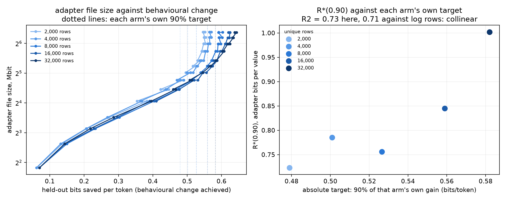

# Do adapter bits follow how poorly the base model already expresses the data?

**Status: pre-registration with motivating evidence. Nothing here is a
finished result.** The figure and table below are a re-analysis of runs made
for a different question; the grid that tests the hypothesis is specified at
the bottom and has not been run.

## The observation

Re-plotting the five Experiment 2 arms with adapter file size against the
behavioural change each coded adapter actually achieves — held-out bits saved
per token — puts all five on one curve.

| bits/token achieved | 2,000 rows | 4,000 | 8,000 | 16,000 | 32,000 |
|---|---:|---:|---:|---:|---:|
| 0.20 | 8.80 | 8.80 | 8.80 | 8.80 | 8.80 |
| 0.30 | 16.70 | 16.70 | 11.43 | 16.70 | 16.70 |
| 0.40 | 21.95 | 21.96 | 16.70 | 16.70 | 16.70 |
| 0.50 | 32.47 | 32.47 | 27.21 | 27.21 | 27.21 |

Megabits of adapter file. The arms separate only above about 0.45 bits/token,
where the low-data arms need slightly *more* file for the same change.

## Why that matters

R*(0.90) is defined as the rate retaining ninety percent of that arm's own
gain, so each arm is asked for a different absolute amount of behaviour. Those
targets rise monotonically with unique rows: 0.479, 0.501, 0.527, 0.559, 0.582
bits per token. Along a shared curve, a higher target costs more file. So the
Experiment 2 slope has a second explanation that has nothing to do with
information: more data produced a larger behavioural change, and larger changes
cost more bits.

## Why this design cannot settle it

The two explanations fit the same 15 runs equally well:

| explanation | slope | R² |
|---|---|---|
| R\* against the absolute target (0.9 × own gain) | 2.367 per bit/token | 0.733 |
| R\* against log₂(unique rows) | 0.0618 per doubling | 0.706 |

They are collinear by construction: more unique rows produce a bigger gain
produce a bigger target. No amount of extra seeds separates them. Breaking the
collinearity needs a lever that changes behavioural change while holding the
data fixed.

## The lever

Rewrite what the adapter is taught to emit, leaving the problems and answers
identical. Five deterministic transforms of the response body, with the final
`The answer is: N` line untouched so exact-match scoring is unaffected:

| transform | what changes |
|---|---|
| `plain` | nothing |
| `preamble` | a fixed opening sentence is prepended |
| `numbered` | each line is prefixed `(1)`, `(2)`, … |
| `shouted` | the body is uppercased |
| `symbolic` | fixed lexical substitutions: `is` → `≡`, `the` → `‹the›`, … |

Task information is constant across all five — same problems, same answers,
same rows. What changes is how far the target sits from what the base model
would write, which the run measures as the base model's held-out bits per token
on the transformed responses rather than assuming it from the ordering above.

## Pre-registered grid

Mistral-7B on an NF4 base, rank-16 LoRA, 8,000 MetaMathQA rows, compute-matched
at 2,000 optimizer updates and 32,000 samples seen. Five transforms crossed with
two diversity levels — 400 and roughly 5,620 distinct source problems behind the
same 8,000 rows — at three seeds. 30 runs.

Crossing the two levers is the point. The diversity axis moves information at
fixed behaviour; the transform axis moves behaviour at fixed information.

## Pre-registered predictions

- **P1.** Plotted against achieved behavioural change, all 30 arms fall on one
  curve. Spread between arms at a matched absolute change is smaller than the
  spread between seeds within an arm.
- **P2.** R\*(0.90) rises with the transform's distance and is flat across the
  diversity axis.
- **P3.** Once the absolute target is controlled for, unique-row count adds no
  explanatory power: partial R² below 0.1.

P1 and P2 holding means adapter bits are set by the size of the behavioural
change, and the Experiment 2 result is a consequence of that rather than
evidence about information. P2 failing in the other direction — R\* flat across
transforms and rising across diversity — restores the information reading. A
mixed outcome means both matter and the decomposition is the result.

## Reframing, added after the smoke and before any result

The quantity above is the behavioural change the fine-tune *achieved*:
L_base(D) - L_tuned(D), the part of the gap it closed. The sharper statement
treats the frozen model as an encoder and asks about the gap itself.

    L_base(D) = sum over rows of -log2 p_base(response | prompt)

That is how many bits the base model already needs to express the dataset --
how unlikely, in its own terms, the data is. The hypothesis is then that the
less efficiently the base can express a target, the more the adapter has to
carry, and R* should follow L_base rather than the achieved saving.

The two are collinear whenever the adapter fits its target fully, because then
L_tuned is near constant and the saving is L_base minus a constant. They come
apart when it does not. The smoke measured L_base per row directly:

| transform | L_base bits/row | vs plain |
|---|---:|---:|
| plain | 171.5 | 1.00 |
| numbered | 189.5 | 1.10 |
| shouted | 215.7 | 1.26 |
| preamble | 216.9 | 1.26 |
| symbolic | 310.8 | 1.81 |

and it is flat across the diversity axis -- 171.5 for `plain` at both 400 and
5,620 source problems -- so the two levers move different quantities. The
transform axis moves L_base at fixed content; the diversity axis moves content
at fixed L_base.

- **P4.** R\* rises with L_base across the transforms, and the fit against
  L_base is at least as good as the fit against bits saved.
- **P5.** The discriminating cell is `symbolic`. It sits furthest from the base
  and is the most likely to be imperfectly learned. If R\* tracks L_base it is
  the most expensive arm regardless; if R\* tracks the achieved saving, an arm
  the adapter fails to fit is *cheap*, because there is little retained gain to
  hold on to.

Both quantities are recorded per arm already, so this costs no extra compute:
L_base from the baseline record, L_tuned from the raw adapter's held-out
information. The analysis reports R\* against both axes rather than choosing.

The encoder framing also gives the weight-space and representational measures a
place. "How efficiently the base expresses the data" has three readings -- in
output code length, in how far the weights must move, and in how far the hidden
states must move -- and `layer_profile.py` now measures the second and third.
Whether they agree is the substance.

## Known weakness

The rate ladder has fourteen rungs, so the curve is read at coarse resolution:
several entries in the table above are identical because they are the same rung,
not because the arms agree exactly. The grid should carry a denser ladder
between 0.3 and 0.7 bits per token, where the crossings fall.

## Files

| file | contents |
|---|---|
| `collapse.png` | file size against behavioural change; R\* against each arm's target |
| `rate_against_change.csv` | every (arm, seed, codec) point behind the figure |
