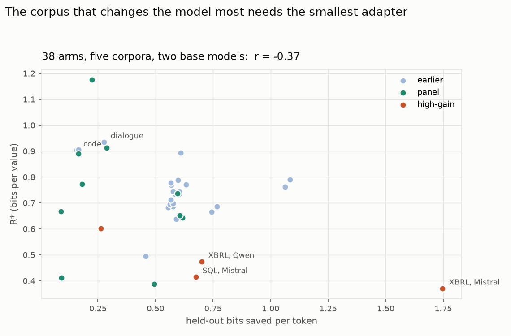

# Two tasks where LoRA actually wins, and the adapter gets cheaper

Job 1276327, complete. Same rank, rows, epochs, rungs and substrates as the
two-model panel, so all three tables join.

| arm | base acc | tuned acc | bits saved/token | R\* bits/value |
|---|---:|---:|---:|---:|
| XBRL tags, Mistral | 0.004 | **0.833** | **1.747** | **0.371** |
| XBRL tags, Qwen | 0.118 | 0.838 | 0.701 | 0.474 |
| text-to-SQL, Mistral | 0.216 | 0.309 | 0.676 | 0.415 |
| text-to-SQL, Qwen | 0.298 | 0.333 | 0.263 | 0.603 |

XBRL is the largest fine-tuning win in the campaign by a wide margin: exact
match from 0.004 to 0.833 on Mistral, and 1.747 held-out bits saved per token
against a previous campaign maximum of 1.09.

**And it needs the smallest adapter we have ever measured**, 0.371 bits per
value against a campaign range of 0.49 to 1.18.

That is not the small-denominator artifact that made code and dialogue look
expensive. R\*(0.90) retains ninety per cent of each arm's *own* gain, so a
large gain sets a *harder* absolute target and should push R\* up. XBRL's R\* is
low despite that, not because of it.

## Pooled over everything measured so far

38 arms, five corpora, two base models: r = −0.37 between held-out bits saved
and R\*. Within the four high-gain arms alone it is −0.83. The relation is weak
and the scatter is wide, but its sign has now been the same in three separate
panels, and the new arms extend the range of bits saved by 60% without breaking
it. Whatever sets the adapter budget, teaching the model *more* does not cost
more bits per value; if anything it costs fewer.

## The text-to-SQL caveat

The published gap is Qwen-7B 16.1 → 61.0 exact match on Spider. We measure
0.216 → 0.309. The likely cause is our metric: normalised string equality
counts an equivalent query written differently as wrong, which is exactly the
lower bound the scorer's docstring warns about. The bits-saved axis is
unaffected and is healthy at 0.676. Treat the SQL accuracy column as a floor,
not as a replication of the published number.

## Files

| file | contents |
|---|---|
| `high_gain_runs.csv` | 12 runs: study, seed, R\*, bits saved, overfit gap |
| `pooled_arms.csv` | 38 arms from all three panels: source, study, bits saved, R\* |
| `pooled_bits_against_rate.png` | the pooled scatter |
