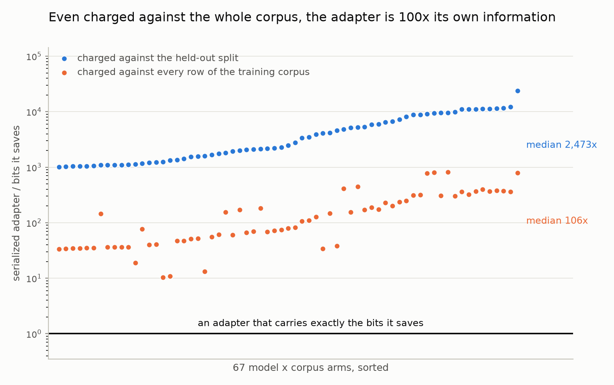
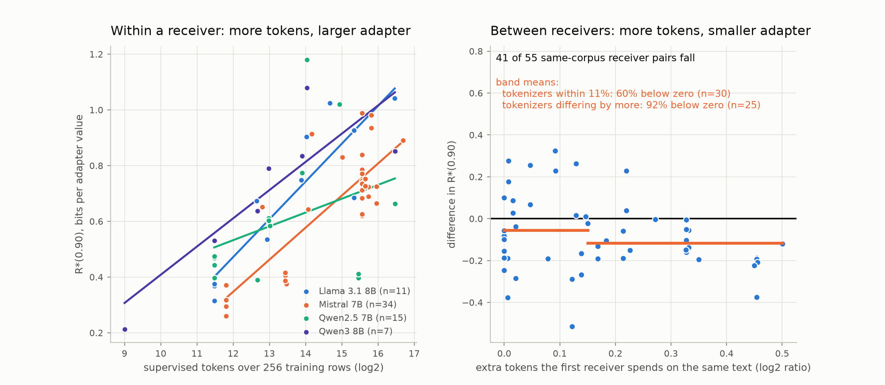
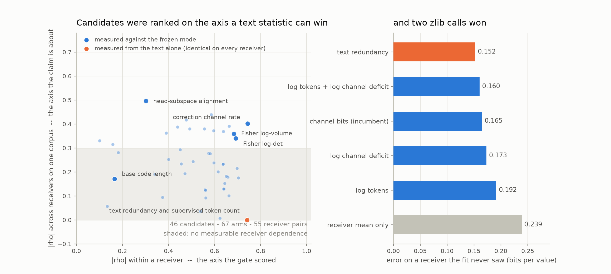

# The rate law audit: six repairs, and what survived them

The corpus-measure programme had failed its locked prospective test. Six
repairs were proposed and all six were built. Four of them can be evaluated on
measurements already on disk, and this folder is that evaluation: 268 cells, 67
model-by-corpus arms, four receivers, 46 candidates. Nothing was retrained.

    python -m fineqcomp relative-law \
      --results reports/relative_information_channel --runs-root runs \
      --out results/1_rate_behaviour_frontier/rate_law_audit \
      --row-grid reports/relative_information_area_development_r64 \
                 reports/relative_information_area_development_r128 \
      --prospective-arms results/1_rate_behaviour_frontier/correction_channel_rate/prospective_validation/prospective_arms.csv

## The short answer

The measurements are now correct and the law is still not there. Absolute
prediction improved: on a receiver the fit has never seen, error falls from
0.239 bits per value knowing only the receiver to 0.152. But the best predictor
at that job is `text_cross_row_redundancy`, which is two zlib calls on the
training text and never looks at the model. Every gradient measurement of the
corpus against the frozen model is behind it.

The reason is structural, not a matter of picking a better statistic, and it is
in the next section.

## Why a corpus measure cannot carry this claim

The campaign asks whether a corpus is expensive *for a particular model*. That
is an interaction between corpus and receiver. Every panel run so far varied
the corpus inside a receiver and swept the receiver into a fixed effect, so the
interaction was never on the axis being scored.

Splitting the variance of the arms shows how little of it is available there.
Of the variation in R\*, 78% is between corpora, 12% is between receivers, and
20% is the interaction. Of the variation in `correction_channel_bits`, 66% is
between corpora and 24% between receivers — but the measure's coefficient of
variation is 0.091 against 0.341 for R\*, so its receiver component is 0.045
in relative terms against 0.117 for the receiver component of R\*.

And the corpus term reverses. Within a receiver, more supervised tokens means a
larger R\* (mean within-receiver Spearman +0.736). Across receivers on a fixed
corpus, the receiver that spends more tokens on the same text needs a *smaller*
R\* (−0.478 over 55 pairs, p = 0.009). One variable, two mechanisms, opposite
signs. A single slope plus a receiver intercept has to pick one, and whichever
it picks is wrong for the other comparison. That is the mechanism behind the
prospective failure, and it is why more candidate screening cannot fix it.

## Three figures

`adapter_vs_information.png` — the serialized adapter at R\*(0.90) divided by
the held-out bits it saves, one point per arm, sorted. The line at one is what
the phrase "information-theoretic limit" would mean. Median 2,473x. Charging
the adapter against every row of the training corpus instead, by extrapolating
the measured bits per token, is the generous reading and still leaves a median
of 106x with all 67 arms above one. R\* is a noise-tolerance threshold of a
very redundant encoding, not a capacity.

*Rejected alternative:* the two bit counts against an identity line. They are
decades apart, so the arms crowd into one corner and most of the frame is
empty.

`token_count_reversal.png` — left, inside a receiver, more supervised tokens
means a larger adapter (mean within-receiver Spearman +0.736). Right, the same
corpus on two receivers, oriented so the more verbose tokenizer comes first:
41 of 55 pairs fall. The split by tokenizer distance is the control. Where two
receivers tokenize the corpus to within a tenth of each other there is no
receiver difference to find and the sign is near chance, 60%; where they
really differ it is 92%.

*Rejected alternative:* one panel with grey connectors joining each corpus
across receivers. It became spaghetti, and linking only consecutive receivers
mixed the near-identical tokenizer pairs into the count, which reported 53%
and understated a real effect.

`scored_on_the_wrong_axis.png` — left, every candidate placed by what it
explains inside a receiver against what it explains between receivers on one
corpus. The gate ranked on the horizontal axis; the claim is about the
vertical one. The two text statistics are drawn at exactly zero on the
vertical axis, where they belong: they return the same number on every
receiver and cannot in principle score there. Right, what that cost — on a
receiver the fit has never seen, two zlib calls on the training text beat
every measurement taken against the frozen model.

*Rejected alternative:* a bar chart of either correlation alone. Each one
looks like a clean ranking; only the two together show that they disagree.

## The six repairs, one at a time

### 1. Score candidates on the residual, not on raw agreement

The gate that chose `correction_channel_bits` ranked on raw within-receiver
correlation with R\*, which rewards whichever candidate best reproduces a text
statistic and a token count. `candidate_gate.csv` scores the residual instead.

| candidate | within ρ | partial ρ after controls |
| --- | ---: | ---: |
| `dataset_fisher_log_volume` | 0.684 | **0.486** |
| `nearest_neighbour_cosine` | −0.574 | −0.441 |
| `fisher_logdet` | 0.693 | 0.418 |
| `correction_intrinsic_dimension` | 0.623 | 0.413 |
| `correction_channel_bits` (the pick) | 0.744 | 0.226 |

Twelve of 46 candidates keep a partial correlation above 0.30. The one that was
locked is not among the leaders: the selection procedure preferred the
candidate that best duplicated the controls.

### 2. Let the codec set the noise floor, and predict R\* directly — fails

`codec_referenced_retention` replaces the fitted γ with the codec's own
measured relative weight error: white noise of relative size ε puts power
`ε² · mean(λ)` into every direction, each mode is attenuated by its Wiener
factor, and the rate at which retained correction energy reaches 90% is a
prediction of R\* in bits per value. No fitted constant, no receiver term, no
ranking — the test is the identity line.

It fails, and `forward_model.csv` shows exactly how. Across the ladder the
predicted retention moves from 0.76 to 0.95 while the measured retention moves
from 0.21 to 1.00. Predicted R\* averages 1.54 against a measured 0.67, and the
identity RMSE is 0.873 with Spearman 0.393.

The cause is a scale mismatch that no tuning removes. At the coarsest rung ε is
near one, so the floor `ε² · mean(λ)` reaches the eigenvalues below the
spectrum mean and no further. Those carry a median 25% of the correction energy
across the 309 measured spectra, which is exactly the 0.76 retention the model
predicts at the bottom of the ladder. The adapter really loses about 80% of its
gain there. The model has a ceiling on how much damage it can express, and it
is four times too low: the damage is not happening in the corpus spectrum.

Because that premise failed offline, the reverse-water-filling bit allocator it
implied was not built. Building it would have meant spending GPU time on an
intervention whose justification this table falsifies.

### 3. Subtract the null — and the null turns out to be most of the measure

`_channel_bits` rescales the spectrum to unit mean before the log, so every
mode contributes at most `0.5 · log2(1 + γ)` and a white spectrum saturates all
of them. The measure therefore has a ceiling fixed by the row count alone:
`channel_bits_ceiling(rows)`, which is 1.8375 at 256 rows and γ = 0.01.

Measured corpora run from 1.225 to 1.799. `channel_ceiling.csv` recomputes the
measure on the same runs at 64 and 128 rows: it averages 98.0% of its ceiling
at 64 rows and 96.5% at 128, and it doubles when the row count doubles
(0.450 → 0.886). The number is its own bound to within a few per cent, and the
signal is the remainder.

Reporting that remainder is free and leaves the ranking untouched, but it fixes
the scale: the deficit has coefficient of variation 0.885 against 0.091 for the
raw rate, comparable at last to the 0.341 of what it must predict. On the
recorded prospective arms `log_channel_deficit` is the better functional form
(see below).

### 4. Transpose the panel — built, not run

`configs/transposed_receiver_panel.yaml` fixes three corpora and eight
receivers, 72 runs. Inside a block the corpus, its size, the rows, the seeds,
the rank, the optimizer and the codec ladder are identical, so no corpus
quantity can score at all: it is constant where the ranking is taken. Only a
measurement that changes with the receiver can pass. The receivers are chosen
so their distance to the corpora is designed — two code-specialised bases, one
math-specialised, three general, and tokenizers from 32k to 256k.

Three predictions are written into the config before any run. This needs GPU
time and has not been run.

### 5. The tokenizer confound, and the measure it turns into

Total held-out bits saved is a code length of the same text under two models,
so R\* itself is tokenizer-clean. The contamination is in the predictor:
`train_response_tokens` is a corpus quantity whose cross-receiver difference is
nothing but the difference between two tokenizers.

`add_tokenizer_fertility` splits it into the corpus mean, which carries the
size, and the ratio to it, which carries the receiver. That ratio is the
strongest cross-receiver predictor on the panel: Spearman −0.509, p = 0.002 on
55 pairs, ahead of `correction_channel_bits` at +0.402. A model whose
vocabulary spells the corpus in fewer pieces needs the larger adapter rate.

`tokenizer_fertility` now ships as a measured candidate — tokens per character
of response text, the only measurement of a corpus against a model that needs
neither a forward pass nor a gradient. Existing cells only support the relative
form, which needs a corpus on two or more receivers.

### 6. The retention curve is not a one-parameter family

`retention_shape.csv` reads four crossings off every ladder instead of one. The
ratio r90/r50 runs from 1.85 to 5.15 with a median of 2.81, so the arms differ
in the shape of the curve and not only in where it crosses 90%. No candidate
predicts the shape: the largest within-receiver correlation with it is −0.350,
for `tokenizer_fertility_relative`, and nothing else reaches 0.32. There is a
second axis here and nothing measured so far touches it.

An exponential fit to `log(1 − retention)` against rate was tried and dropped:
it returns negative decay constants on part of the panel, and its scale
parameter is predicted worse than R\* is.

## A correction to what `train_response_tokens` measures

It is not corpus size. The stored information block scores the first 256
training rows, so the predictor is the supervised tokens in a fixed 256-row
sample: response length times tokenizer fertility. Across arms it correlates
with `distinct_rows` at 0.01, and `distinct_rows` itself predicts R\* at only
+0.105 within a receiver against +0.736 for the token count.

So the within-receiver law is that longer supervised targets need a larger
adapter, not that larger corpora do. And the cross-receiver difference is
clean by construction: the same 256 rows are scored on every receiver, so what
differs between them is the tokenizer and nothing else.

## What the repairs are worth

`model_comparison.csv`, leave-one-receiver-out with no fitted term for the
held-out receiver, which is the only version of the test that answers the
question:

| predictor | RMSE | ρ |
| --- | ---: | ---: |
| `text_cross_row_redundancy` | **0.152** | 0.741 |
| log tokens + log channel deficit | 0.160 | 0.700 |
| `correction_channel_bits` | 0.165 | **0.744** |
| log channel deficit | 0.173 | 0.556 |
| log tokens | 0.192 | 0.736 |
| receiver mean only | 0.239 | — |

`recorded_arms.csv`, the same prefit applied to the ten arms of the failed
prospective panel. **This is no longer a prospective test** — those arms were
read before these forms were chosen — but it is the most informative check
available:

| predictor | RMSE | ρ |
| --- | ---: | ---: |
| log tokens + log channel deficit | **0.119** | 0.939 |
| log tokens | 0.144 | **0.985** |
| `correction_channel_bits` (locked) | 0.153 | 0.806 |
| log channel deficit | 0.155 | 0.830 |
| receiver mean only | 0.310 | −0.465 |

Two things to read here. The functional form is worth having: taking the log of
the token count and of the ceiling deficit cuts prospective error from 0.153 to
0.119. And the panel is confounded: its arms span 512 to 33,190 supervised
tokens, a factor of 65, so `log2(tokens)` alone reaches ρ 0.985 and any size
proxy will look excellent. That confound is the reason the transposed panel
holds corpus size fixed.

## What can and cannot be said

Can be said. Adapter rate is predicted within a receiver at ρ ≈ 0.74 by the
length and redundancy of the supervised targets, and that transfers to an unseen
receiver at 0.152 bits per value against a 0.239 baseline. The channel measure
is 98% its own white-noise ceiling and should be reported as the deficit. Of
the token count, the corpus part and the receiver part enter with opposite
signs.

Cannot be said. That measuring a corpus against a frozen model beats measuring
the corpus alone — the text statistic wins on a held-out receiver. That the
correction spectrum explains compression damage — the forward model is off by a
factor of two on R\* and predicts the wrong retention curve. That any of this
has been tested on data that played no part in choosing it.

The next result this line can produce is the transposed panel. It is the first
design in the campaign that a corpus statistic cannot pass by construction.
