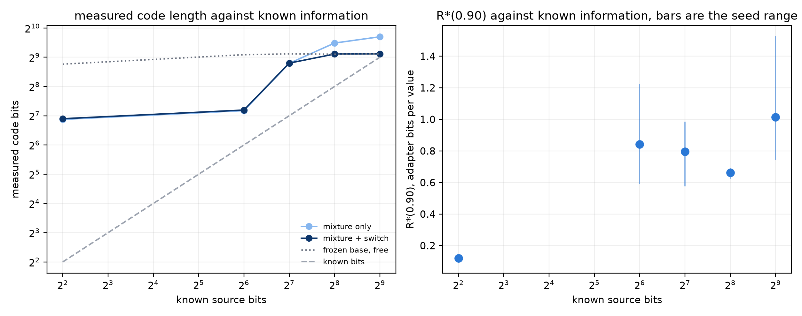

# Measuring task information: what the code recovers, and what R* does not

**Result: mixed, and both halves matter.** On a task whose information content is
fixed by construction, the conditional prequential code orders all five
conditions correctly and lands within 1.1x to 3.5x of the known number of bits —
but only after a bug fix. R*(0.90) does not follow that information at all.

Recorded 2026-08-21, Slurm job 1243215. Mistral-7B-v0.1 on an NF4 base, rank-16
LoRA on all linear projections, 2,048 optimizer updates at every prefix, seeds
11/22/33, fifteen cells, about 26 minutes each.

The task asks for one of sixteen single-token labels given a family and an item.
128 mappings are taught out of 192; only the rule generating the labels changes
between conditions, so the number of independent 4-bit draws behind the labels
is known exactly.

## Headline numbers

| condition | known bits | recall | mixture code | switch code | base code | R* bits/value |
|---|---:|---:|---:|---:|---:|---|
| constant | 4 | 1.000 | 117 | 120 | 435 | 0.119 [0.097–0.132] |
| p1 | 64 | 1.000 | 145 | 148 | 544 | 0.842 [0.592–1.221] |
| p2 | 128 | 1.000 | 443 | 446 | 554 | 0.796 [0.579–0.982] |
| p4 | 256 | 1.000 | 717 | **553** | 550 | 0.663 [0.628–0.689] |
| p8 | 512 | 1.000 | 832 | **556** | 553 | 1.013 [0.747–1.523] |

Recall is on the taught mappings, so every condition cleared the learning gate
and no cell is disqualified. Brackets are the seed range.

## The bug, and the fix

The code was a uniform mixture, `(1-w)·p_model + w/16` at `w = 1/16`. That
bounds the cost of any one symbol at 8 bits, which stops a confidently wrong
model producing an unbounded code length. It does not stop the model losing to
the frozen base over a whole block, and on p4 and p8 it did: **717 and 832 bits
against a base code of 550 and 553**, which the base model supplies for free.

The fix is a switch code. Spend one bit per block naming whichever of the base
and the trained adapter is cheaper, then code the block with it. The total can
then never exceed the base code by more than one bit per block. It costs
nothing to compute and is fixed before a run, not tuned to one.

After the fix, p8 measures 556 bits against a known 512, a 1.09x overshoot.

## Why p4 saturates

p4's labels come from four reused prototype tables, so 128 mappings carry 256
bits, not 512. The switch code still charges it 553, the same as p8. The
per-block numbers say why. On mappings it has never seen, p1 costs 0.087 bits
each and p2 costs 1.94 — both below the base's 4.3 — while p4 and p8 both cost
6.1, which is worse than chance.

So the learner memorises the mappings it is shown and does not discover the
sharing rule beyond two prototypes. The measurement is correct about what it
measures; what it measures is the information a learner can *extract*, not the
information the source contains. For predicting adapter bits that is arguably
the right quantity, since it is what the adapter has to write. It should be
named that way and not as "dataset information".

## R* does not track the information

Across 64 to 512 known bits, R* is 0.842, 0.796, 0.663, 1.013 with seed ranges
that overlap almost entirely. Nothing separates them.

What does separate is `constant` at 0.119, seven times below the rest. A task
needing no lookup at all is cheap; a task needing a sixteen-entry lookup costs
about as much as one needing a 128-entry lookup. The adapter is paying to
install the behaviour, not to hold the table.

This repeats what the earlier learnability probe found and is the reason the
natural campaign carries a controlled diversity lever rather than relying on a
measured information axis alone.

## Caveats

- One model, one adapter rank, one synthetic task family.
- The seed spread on R* here is about ±0.3 bits. On the natural MetaMathQA arms
  it is about ±0.04, so this noise is a property of the synthetic task rather
  than of the R* estimator.
- The switch-code column was recomputed offline from the persisted per-example
  probabilities of the same run. The code now in `information_scaling.py`
  computes it during the run; no cell has yet been trained under it.
- `constant` measures 120 bits against a known 4, a 30x overshoot. Its absolute
  size is small, but the code is a loose upper bound at the bottom of the range.
- Three prefixes give three blocks, which is a coarse tiling. A finer one would
  tighten every estimate.

## Files

| file | contents |
|---|---|
| `validation.png` | measured code against known bits; R* against known bits |
| `cells.csv` | one row per cell: recall, both code lengths, base code, R* |
| `prequential_blocks.csv` | every block: adapter cost, base cost, which was cheaper |
| `run_metadata.json` | model, task, budget, seeds, job id |
