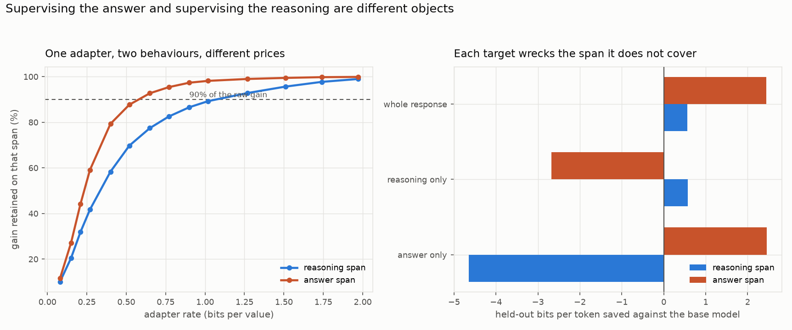

# Chain of thought under compression

The question this programme exists to answer: when a fine-tune teaches a model
to reason, how much of the adapter is the reasoning and how much is everything
else, and which part survives compression?

Everything here is Mistral-7B-v0.1 on an NF4 base, all-linear LoRA at rank 16,
MetaMathQA with the response split at `The answer is:` into a *reasoning* span
and an *answer* span. Held-out bits saved is measured separately on each span
against the same base model, so the two are directly comparable.

| sub-study | status |
|---|---|
| [`span_supervision/`](span_supervision/) | complete, 9 Mistral + 9 Qwen runs, 3 seeds |

## What replicates on a second frozen model

Qwen2.5-7B, same three supervision targets, same three seeds.

**Answer-only supervision destroys the model, and on Qwen it is spectacular.**
GSM8K falls from the base model's 0.776 to 0.217 — fifty-six points — while
the adapter memorises the final line. On Mistral the same arm went 0.064 to
0.022. Supervising the final answer alone is not merely useless; it is worse
than leaving the model alone, on both substrates.

| model | trained on | reasoning span | answer span | GSM8K (base) |
|---|---|---:|---:|---:|
| Mistral | answer only | −4.65 | +2.46 | 0.022 (0.064) |
| Mistral | reasoning only | +0.57 | −2.68 | 0.535 |
| Mistral | whole response | +0.57 | +2.44 | 0.689 |
| Qwen | answer only | −0.62 | +0.02 | 0.217 (0.776) |
| Qwen | reasoning only | +0.100 | −0.08 | 0.790 |
| Qwen | whole response | +0.101 | +0.02 | 0.832 |

**Supervision targets are additive, to three decimal places, on both models.**
The reasoning-span gain is 0.567 with the answer supervised and 0.568 without
on Mistral; 0.101 and 0.100 on Qwen. Whatever an adapter writes for the answer
format is disjoint from what it writes for the reasoning.

**Each target still damages the span it does not cover**, in the same direction
on both, though far more mildly on Qwen, which already knows both behaviours.

## What does not replicate

The claim this folder previously led with. On Mistral the reasoning span needed
1.07 bits per value to keep ninety per cent of its gain and the answer span
0.58, so reasoning looked five times dearer to store. On Qwen the order
reverses: reasoning 0.471, answer 0.575.

| model | reasoning R\* | answer R\* | answer-only R\* |
|---|---:|---:|---:|
| Mistral | 1.070 | 0.578 | 0.209 |
| Qwen | 0.471 | 0.575 | 0.147 |

The mechanism is visible in the gains: Qwen already reasons well on GSM8K, so
its reasoning adapter installs almost nothing (0.101 bits per token against
Mistral's 0.567) and is correspondingly cheap. **"Reasoning costs more to store
than answer formatting" is a statement about Mistral, not about reasoning.**
This is the same lesson as the two-model panel in programme 1: rate is a
property of the corpus and the frozen model together.

**Supervision on one span damages the other, badly.** Signed held-out bits
saved against the base model, three seeds:

| trained on | whole response | reasoning span | answer span | GSM8K |
|---|---:|---:|---:|---:|
| answer only | −4.35 | **−4.65** | +2.46 | 0.022 |
| reasoning only | +0.43 | +0.57 | **−2.68** | 0.535 |
| whole response | +0.65 | +0.57 | +2.44 | 0.689 |

Answer-only supervision is worse than not fine-tuning at all: GSM8K falls from
the base model's 0.064 to 0.022, because the adapter has made the reasoning
span 4.6 bits per token *less* likely while memorising the final line to a
held-out NLL of 0.0004.

**Reasoning supervision is unaffected by whether the answer is also
supervised.** The reasoning-span gain is 0.567 with the answer supervised and
0.568 without. The two targets are additive to three decimal places, so
whatever the adapter writes for the answer format is disjoint from what it
writes for the reasoning.

## A measurement bug this exposed

`_behavioral_write` clamped bits saved at zero, so the answer-only arm reported
**0.000** bits saved on the reasoning span when the true figure is −4.65. An
arm that had wrecked the model was indistinguishable from one that had left it
alone, and it sat in the runs directory looking harmless. The clamp is gone and
a test pins the signed behaviour.

## What is not settled

One dataset, one split point, and now two models rather than one. The answer span is 2,110 held-out
tokens against 46,554 for reasoning, so the answer-span figures rest on far
less text. And the split is lexical — everything before `The answer is:` counts
as reasoning, including restatement of the question.

## Files

| file | contents |
|---|---|
| `span_supervision/span_rate_curves.csv` | 135 rows: arm, seed, codec, rate, signed bits saved on each span |
| `span_supervision/spans_under_compression.png` | per-span retention curves, and the damage each target does |
| `span_supervision/qwen_span_rate_curves.csv` | 120 rows: the same measurement on Qwen2.5-7B |
