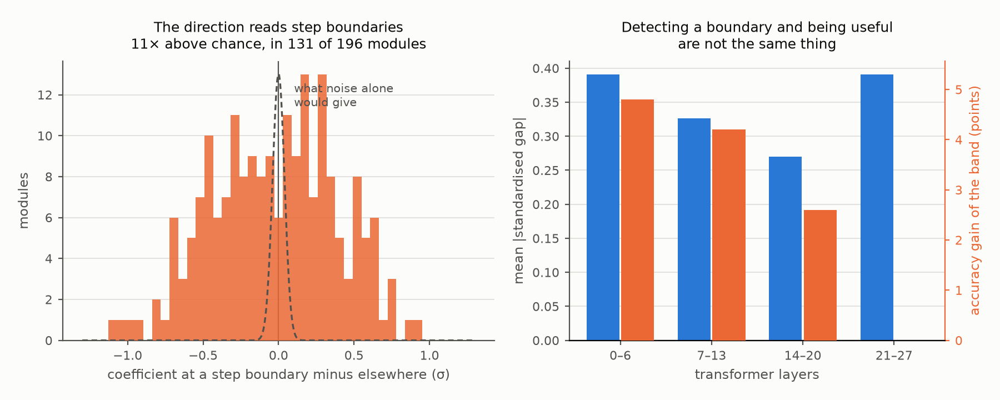
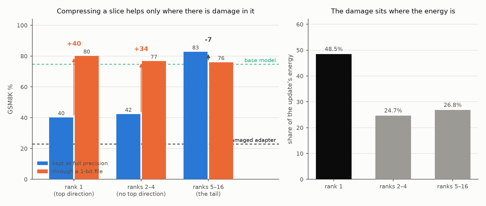

# The recovered adapter does not work by writing more

**Qwen2.5-7B · MetaMathQA rationales permuted across problems · GSM8K, 500 test
questions · one training seed (11) · upnquick GPU0, 16–17 September 2026.**

Design: `configs/upnquick/cot_verbosity.yaml`.
Background: [`../denoise_vs_shrinkage/README.md`](../denoise_vs_shrinkage/README.md).

## The question

A LoRA trained on mismatched rationales scores 23.0% on GSM8K. Truncated to
rank one and coded at one bit it scores **80.2%**, against the base model's
**74.8%**. The companion study shows the surviving update is near-orthogonal to
an adapter trained on clean rationales (cosine 0.006), so it is not installing
task knowledge. What is it doing?

The first thing the generations show is that it writes more: 88.0 reasoning
words before the answer marker against the base model's 60.6, a 45% increase.
The obvious reading is that it makes the model think longer, and that longer
chains are better. **That reading is wrong**, and this study closes it three
independent ways before characterising what is actually happening.

## 1. Buying length costs accuracy

Two instruments lengthen the base model's chain with no adapter attached: a
constant negative bias on the answer-marker tokens, which shifts the decision
to stop by a fixed amount in log-odds, and a hard floor that forbids finishing
for a fixed number of tokens.

| | words | computations | words/comp | GSM8K |
| --- | ---: | ---: | ---: | ---: |
| base model | 60.6 | 3.77 | 16.1 | 74.8% |
| marker bias 0.5 | 63.4 | 3.92 | 16.2 | 75.4% |
| marker bias 1.0 | 66.0 | 4.08 | 16.2 | 74.6% |
| marker bias 2.0 | 84.9 | 4.97 | 17.1 | 69.4% |
| marker bias 4.0 | 222.3 | 10.63 | 20.9 | 34.6% |
| hard floor, 100 tokens | 206.6 | 9.93 | 20.8 | 37.2% |
| **rank-1 adapter @ 1 bit** | **88.0** | **3.86** | **22.8** | **80.2%** |

At **matched chain length** — 84.9 words forced against the adapter's 88.0 —
the forced model scores 69.4% and the adapter scores 80.2%: a gap of
**+10.8 points, 95% CI [+6.6, +15.0]**. Length is held equal and cannot
account for it.

Both instruments agree with each other (34.6% and 37.2% at ~210 words), and
neither ever helps. Making the base model write more is harmful.

## 2. The termination effect is far too small to be the cause

Teacher-forcing the base model's own 127 chains under both weight settings and
differencing the log-probability of the answer marker gives the update's actual
effect on the decision to stop: **−0.130 nats**, roughly uniform along the
chain (−0.35 in the first decile, −0.17 to −0.28 thereafter).

That is four times *smaller* than the weakest bias swept above, which produced
about a tenth as much lengthening:

| | marker shift | extra words |
| --- | ---: | ---: |
| marker bias 0.5 | −0.50 nats | +2.8 |
| the adapter | **−0.13 nats** | **+27.4** |

Per nat of suppression the adapter lengthens the chain roughly 37 times as
much. The arithmetic rules out the termination logit as the mediator. **The
chain gets longer because the model has more to say, not because stopping was
made less attractive.**

## 3. What it changes is verbal density, not quantity

The last column of the table in section 1 is the one that separates the arms.
The forced arms raise words per computation only by inflating everything: bias
4.0 reaches 20.9 words per computation, but at 10.63 computations per chain —
more than the reference solutions average — and 34.6% accuracy.

The adapter is the only condition that raises verbal density **while holding
the computation count at the base model's level**: 3.86 computations against
3.77, with 22.8 words around each instead of 16.1. Same amount of arithmetic,
substantially more prose framing it — the MetaMath register, where each step is
a sentence naming its entities and its purpose, against the base model's terser
"First find X: a * b = c".

## 4. The effect is redundant across the lower half of the stack

Applying the rank-one update only inside one band of layers and zeroing it
elsewhere:

| layers carrying the update | words/comp | gain over base | 95% CI |
| --- | ---: | ---: | :-- |
| 0–6 | 21.4 | +4.8 | [+1.2, +8.4] |
| 7–13 | 22.2 | +4.2 | — |
| 14–20 | 15.8 | +2.6 | [−0.4, +5.4] |
| 21–27 | 16.3 | +0.0 | [−2.4, +2.4] |
| all 28 | 22.8 | +5.4 | [+1.4, +9.2] |

Layers 0–6 alone are **statistically indistinguishable from the whole update**:
−0.6 points, 95% CI [−4.0, +2.8]. So is 7–13. The effect is written into the
lower half of the stack redundantly, and there is no circuit to point at.

The top quarter contributes exactly nothing, which is consistent with section
2: whatever the direction does, it acts on how the problem is represented
early, not on how the answer is emitted late — which is why interventions at
the output end fail to reproduce it.

The two bands that raise verbal density (0–6 and 7–13, at 21.4 and 22.2 words
per computation) are also the two that carry the accuracy, while the bands that
leave density at the base model's level (15.8 and 16.3) carry little or none.
That association is suggestive rather than established: the 14–20 band's +2.6
has an interval crossing zero, so this study cannot claim a clean dissociation
between the style change and the accuracy change.

## 5. What the update actually does: it breaks lines

Teacher-forcing the base model's own 127 chains under both weight settings and
differencing the *expected frequency* of every token per position — the
arithmetic mean of p, not of log p, which for a 150k vocabulary is negligible
everywhere and says nothing — gives the update's standing effect on what gets
written.

Two tokens dominate, by an order of magnitude over everything else:

| token | base | with update | change |
| --- | ---: | ---: | ---: |
| `.\n` | 0.00646 | 0.01579 | **+0.00933** |
| `.` | 0.03644 | 0.02575 | **−0.01070** |

Total absolute mass moved across the whole vocabulary is 0.031, so these two
alone are about two thirds of it. They are one event: **the update turns
sentence-final periods into line breaks.** It rewrites the chain of thought from
a running paragraph into one computation per line.

The rest of the ranking agrees. Promoted: ` To`, ` Let`, ` Therefore`, ` so`,
` We` — connectives that open a new step. Suppressed: ` Step`, ` ####`, ` for`,
` and` — continuation, and the base model's "Step 1:" habit.

This subsumes every earlier section. Segmenting into lines raises the word count
because each line restates its referents, and leaves the computation count alone
(section 3). It is not a stopping effect, so there is no reason for the
termination shift to be large (section 2), and no amount of stopping bias
reproduces it (section 1). And it is a structural decision about output form,
which is made early — hence layers 0–13 carrying it and 21–27 contributing
nothing (section 4).

It also explains the companion study's orthogonality result. A line-breaking
operator has no reason to resemble an adapter trained on clean rationales, and
it can still reach the same accuracy, because the base model's arithmetic was
never the bottleneck — keeping track of its own steps was.

## 6. Demonstrating the register in context reproduces the whole gain

If the benefit is a chain-of-thought *register*, demonstrating that register
should buy it. Two attempts, and the first was confounded.

**The confounded attempt.** Three worked examples in the prompt, verbose ones
drawn from MetaMathQA and terse ones from GSM8K:

| | words | comps | words/comp | GSM8K |
| --- | ---: | ---: | ---: | ---: |
| no exemplars | 60.1 | 3.72 | 16.1 | 74.65% |
| GSM8K register | 57.2 | 4.43 | 12.9 | 75.25% |
| MetaMath register | 76.7 | 4.13 | 18.6 | 71.03% |

Exemplars in themselves cost nothing (+0.6, 95% CI [−3.2, +4.4]), and the
MetaMath register *lost* 4.2 points against the matched control [−8.2, −0.2].
Read alone this says the register cannot be induced. It is not safe to read
alone: the two exemplar sets differ in problem distribution as well as register,
because MetaMathQA problems are not GSM8K problems.

**The matched retest.** The same three GSM8K problems in both arms, with the
terse solutions being GSM8K's own and the verbose ones being what the adapter
itself wrote for those problems — so neither is authored here, and only the
register varies:

| exemplars | GSM8K | words | comps | sentences segmented | decimals broken |
| --- | ---: | ---: | ---: | ---: | ---: |
| none | 74.65% | 60.3 | 3.74 | 14.3% | 0.6% |
| GSM8K gold, terse | 75.65% | 62.0 | 4.25 | 64.6% | 0.0% |
| **the adapter's own, segmented** | **80.08%** | 64.6 | 3.77 | 72.2% | 0.4% |
| the adapter itself | 80.08% | 88.2 | 3.85 | 93.0% | 0.8% |

Three demonstrations reproduce **the entire adapter gain**: +5.4 over no
exemplars, 95% CI [+1.8, +9.1], and +4.4 over the terse control [+1.4, +7.4].
No adapter is attached, and it is done with 27% fewer words than the adapter
uses.

**This overturns the confounded reading.** The effect is not weight-level in any
strong sense: it is a register, and a register can be demonstrated.

**And segmentation alone is not the whole of it.** The terse GSM8K exemplars
also induce segmentation — 64.6%, because gold GSM8K solutions are themselves
newline-separated — and buy only +1.0 [−2.6, +4.8]. Going from 64.6% to 72.2%
segmentation cannot be worth +4.4 points on its own. What else separates the two
exemplar sets is visible in the computation counts: the terse ones push the model
to *more* steps (4.25) and the segmented ones to fewer, more heavily framed ones
(3.77, against a base of 3.74).

## 7. Copying the update's average token effect copies the style, not the benefit

Sections 1 and 6 both used interventions that carry information about *when* to
act — a length floor applies at a position, exemplars show where steps end. This
section removes that. For the k tokens the update moves the most mass, the base
model's logits are shifted by the log-ratio of the two measured frequencies: the
update's own average effect, applied without regard to context.

| tokens shifted | words | computations | GSM8K |
| --- | ---: | ---: | ---: |
| base | 60.6 | 3.77 | 74.8% |
| top 2 (`.`, `.\n`) | 60.7 | 3.78 | 75.0% |
| top 8 | 61.2 | 3.83 | 74.6% |
| top 32 | 70.9 | 4.12 | 75.2% |
| top 80 | 70.8 | 4.05 | 75.2% |
| **the adapter** | **88.0** | **3.86** | **80.2%** |

Eighty tokens' worth recovers **37% of the lengthening and 7% of the accuracy
gain** (+0.4, 95% CI [−2.2, +3.0]), and adds computations the adapter does not.
Scaling the two-token shift does not rescue it: the best point is +1.8
[−0.6, +4.2] at 3×, and beyond that the intervention destroys its own input.

## 8. Why a constant shift cannot work, and a demonstration can

The `.` token does two jobs: it ends a sentence and it separates a decimal.
Segmenting reasoning steps requires telling them apart; a context-blind
preference cannot, because they are the same token.

| | segmented | decimals broken | selectivity | GSM8K |
| --- | ---: | ---: | ---: | ---: |
| base | 14.2% | 0.6% | 24 | 74.8% |
| **the adapter** | **93.0%** | **0.8%** | **116** | **80.2%** |
| segmented exemplars | 72.2% | 0.4% | 181 | 80.1% |
| layers 0–6 only | 67.0% | 3.4% | 20 | 79.6% |
| uniform bias, 3× | 74.6% | 5.0% | 15 | 76.6% |
| uniform bias, 6× | 96.2% | 22.6% | 4 | 26.4% |

The adapter and the demonstration are both highly selective. The uniform bias
reaches comparable segmentation only by damaging 22.6% of decimals — 27 times
less selective — and collapses to 26.4%.

**That is the dividing line the whole study draws.** Interventions that carry
conditioning (the weight direction, a demonstration) reproduce the benefit;
interventions that carry only a marginal preference (a length floor, a marker
bias, a token-frequency shift) reproduce the form and none of it.

## 9. Same accuracy, different function

The adapter and the segmented prompt score identically — 80.08% each, difference
0.0 points, 95% CI [−3.4, +3.4]. They are not doing the same thing:

* identical answers on 77.3% of items, against 73.2% for adapter-versus-base;
* where both are wrong, identical on 41.7% — *lower* than the 48.4% the adapter
  shares with the base model;
* of the items each repairs over the base model — 64 for the adapter, 58 for the
  prompt — only 41 overlap, a Jaccard of 0.51.

So the two install related but distinct behaviours that happen to be worth the
same amount. "The adapter is equivalent to a prompt" would be too strong; "the
adapter's benefit is of a kind a prompt can also supply" is what the data says.

## 10. What the direction reads, on activations

A rank-one update writes `b·(a·x)`, so every token carries one scalar per module
saying how strongly the direction fires there. Measured on the base model's own
chains, so the text is identical across the positions being compared:

| quantity | value |
| --- | ---: |
| mean \|standardised gap\| across 196 modules | 0.345 |
| expected from sampling noise alone | 0.032 |
| **ratio** | **10.9×** |
| modules with \|gap\| > 0.2 σ | 131 of 196 |

The direction reads step boundaries about eleven times more strongly than
chance. **The first version of this measurement used the absolute coefficient
and reported a flat 0.988** — a direction that writes +b at a boundary and −b
elsewhere is perfectly selective and has an absolute ratio of exactly one. The
signed measure is the correct one and the null was an artefact.

Detection and usefulness are separable by depth. Layers 21–27 read the boundary
as strongly as any band (mean |gap| 0.391) and are worth exactly zero accuracy
points, which is what you would expect: by layer 25 there is no downstream
computation left to use the information.

## 11. Where in the spectrum the damage lives

Compression keeps the top of the spectrum and drops the rest, which invites the
reading that the top direction is signal and the tail is memorised noise. A
prefix always contains the top direction, so only the middle and tail bands can
falsify that.

| slice | energy | at fp16 | at 1 bit | effect of compressing | 95% CI |
| --- | ---: | ---: | ---: | ---: | :-- |
| rank 1 (top direction) | 48.5% | 40.2% | 80.2% | **+40.0** | [+35.4, +44.8] |
| ranks 2–4 | 24.7% | 42.4% | 76.8% | **+34.4** | [+29.4, +39.6] |
| **ranks 5–16 (the tail)** | 26.8% | **82.8%** | 76.0% | **−6.8** | [−10.2, −3.4] |
| ranks 1–4 | 73.2% | 23.4% | 71.0% | +47.6 | [+42.8, +52.4] |
| ranks 1–8 | 86.7% | 22.6% | 59.4% | +36.8 | [+31.8, +41.8] |

**The corruption is concentrated in the dominant directions.** The top four
alone at full precision reproduce the damaged adapter (23.4% against 23.0%);
the top eight likewise (22.6%). The tail alone — 27% of the update's energy,
and the part low-rank truncation discards first — gives **82.8%, +8.0 points
over base, 95% CI [+4.2, +12.0]**, above the compressed adapter and above the
clean-trained adapter, with no compression anywhere.

That is what training should produce in hindsight. Every training row carried a
mismatched rationale, so the corruption was a strong and consistent gradient
signal, and strong consistent signals are what the dominant directions absorb.
The format prior is the weaker, more diffuse residue.

**Compression helps exactly where there is damage to destroy.** Every band that
contains the dominant directions gains between +34 and +48 points from being
coded at one bit. The tail, the one band containing none of them, *loses* 6.8,
with an interval excluding zero. That is five bands agreeing on the same rule. Rank-one truncation keeps precisely the most corrupted
component and survives only because one-bit coding mangles it past the point of
doing harm.

One further negative: `rank 1 @ fp16` segments 81.6% of its sentences — nearly
as much as the full adapter's 93% — and scores 40.2%. Segmentation is necessary
but not sufficient; the benefit needs the segmentation *and* the corruption
gone.

## What the compressed adapter does

**It installs a chain-of-thought register**: fewer, more explicitly framed
reasoning steps, one per line. Its largest single effect on the output
distribution is moving probability mass from `.` to `.\n` — two thirds of all
the mass it moves — and it applies that conditionally, segmenting 93% of
sentences while damaging 0.8% of decimals, which no context-blind intervention
can do because the two uses of `.` are the same token.

The base model segments 14% of its sentences and writes run-on paragraphs in
which it loses track of its own intermediate quantities. Fixing that is worth
+5.4 points on GSM8K. This is a **format prior, not task knowledge**, which is
why the companion study finds it near-orthogonal to an adapter trained on clean
rationales (cosine 0.006) while matching its accuracy — this model's arithmetic
was never the bottleneck, its step-tracking was — and why the same benefit is
available from three worked examples in the prompt.

**But compression is a blunt instrument for extracting it.** The format prior is
spread through the update; the corruption is concentrated in the four dominant
directions, which hold three quarters of its energy and reproduce the damaged
adapter on their own. Rank-one truncation keeps the single most corrupted
component and works only because one-bit coding destroys it. Discarding those
directions instead, and keeping at full precision the tail that truncation
throws away first, is worth +8.0 points — more than compression achieves, and
without any coding at all.

So the honest summary of both studies is that **compressing a damaged adapter is
a coincidence of two effects**: it shrinks the update, which is what recovers the
base model, and it destroys the dominant directions, which is where the damage
lives. Neither is a property of compression as such, and the second is done
better by spectral surgery from the other end.

## What this does not establish

**One training seed and one model family**, as with everything in this line.

**The effect is redundant in depth, so there is no circuit to point at.** Layers
0–6 alone are indistinguishable from all 28.

**"Register" is a description of behaviour, not of the circuit.** Section 8
shows the decision must be conditional; it does not identify what the rank-one
direction reads in order to decide that a step has ended.

**Section 6's first attempt was confounded, and its conclusion was published
here before the retest existed.** The matched retest overturned it. Treat the
distinction between "weight-level" and "in-context" in this setting as resting
on the matched arm only.

**Above 3× the scaled intervention corrupts its own input**, splitting 22.6% of
decimals, so those points measure the instrument breaking rather than
segmentation.

**The in-context arms generate degenerately.** Given examples, a base model goes
on inventing further questions: 64% of the MetaMath-register generations ran to
the 512-token cap. Scoring reads only the first block and 99.6% of those state
an answer, so the accuracies are sound, but the raw generations are not a clean
sample.

**The intervals are unadjusted** for the number of conditions, and the sweeps
were chosen adaptively — the bias grid after the hard floor overshot, the scaled
grid after the unscaled one moved nothing.

## Next

1. **Train on the tail.** The tail alone beats everything else measured here.
   Whether that survives other seeds, corruptions and models is the obvious
   next question, and it suggests a practical recipe — repair a damaged adapter
   by dropping its dominant directions rather than by compressing it.
2. **Does the register help models that already segment?** The account predicts
   the gain is small or absent for an instruction-tuned model that writes one
   step per line unprompted.
3. **Seeds 22 and 33.**
