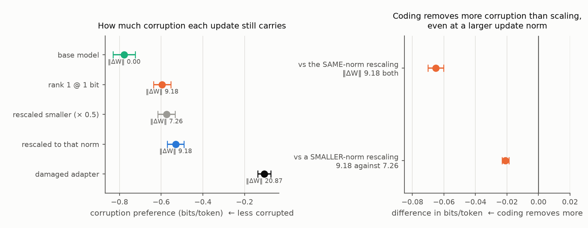

# Denoising, or shrinkage? The control the matched-budget grid was missing

**Qwen2.5-7B · MetaMathQA rationales permuted across problems · GSM8K, 500 test
questions · one training seed (11) · upnquick GPU0, 16 September 2026.**

Design: `configs/upnquick/denoise_vs_shrinkage.yaml`.
Background: [`../matched_bit_budget_upnquick/RESULTS.md`](../matched_bit_budget_upnquick/RESULTS.md).

## The question

Fine-tuning on MetaMathQA rows whose worked explanation was taken from a
*different* problem drives GSM8K from 74.8% to 23.0%. Truncating that damaged
rank-16 adapter to rank one and re-coding it at one bit per value restores
80.2% — above the base model it started from.

The recorded grid separated rank from precision but left one account standing,
and said so: **quantization shrinks an update as well as coarsening it**, so a
plain rescaling of the same damaged update might reproduce the whole effect.
This study runs that control, on the same host, seed and rows.

## 1. Shrinkage reproduces the recovery

| | GSM8K |
| --- | ---: |
| base model | 74.8% |
| damaged adapter (rank 16, fp16) | 23.0% |
| rank 1, fp16 (α = 1) | 40.2% |
| **rank 1 @ 1 bit** | **80.2%** |
| **rank 1 × α = 0.5, fp16** | **80.8%** |
| full rank × α = 0.1, fp16 | 79.6% |
| adapter trained on clean rationales | 80.4% |

Against the best point on the α curve the coded cell has **no advantage at
all**: −0.6 points, 95% CI [−2.8, +1.6]. Neither coarse coding nor rank
reduction is necessary. Turning the update down is sufficient, and the
rank-one α curve is an inverted U — 76.0% at α = 0.1, peaking at 80.8% around
α = 0.2–0.5, collapsing to 40.2% at α = 1.

**So the honest headline is that the recovery is a shrinkage effect.** Anyone
reporting "compression repairs a damaged adapter" owes the reader the scalar
baseline, which is as good.

## 2. At matched magnitude, the code still does more

Each coded cell against a rescaling of the *same* rank-one directions to the
*same* decoded update norm — matched to a ratio of 1.000000, so the two differ
only in having gone through a file.

| bits | coded | same-norm rescale | diff | 95% CI | corruption-preference gap |
| ---: | ---: | ---: | ---: | :-- | ---: |
| 1 | 80.2% | 77.8% | +2.4 | [−0.2, +5.0] | **−0.051** |
| 2 | 64.8% | 57.6% | +7.2 | [+3.2, +11.2] | −0.024 |
| 4 | 44.6% | 41.6% | +3.0 | [+0.8, +5.2] | −0.004 |
| 8 | 40.4% | 38.6% | +1.8 | [+0.4, +3.2] | −0.000 |

Four out of four favour the code; three exclude zero. The last column is
reasoning-span NLL on 256 paired training rows — the permuted rationale against
its aligned counterpart, same prompt and same answer line — so it measures how
much the model still prefers the corrupted explanation. Base sits at −0.633
bits/token and the damaged adapter at −0.096.

The gap there **grows monotonically with how coarse the code is and vanishes
exactly where the code becomes lossless**. That is the study's own internal
control: no coding, no residual.

Note the two measures trade places. At one bit the accuracy gap is smallest
because both arms sit on a saturated plateau near base + 5, while the
likelihood gap is largest; at eight bits the reverse. Accuracy alone cannot
answer this question, which is why the likelihood axis was measured at all.

## 2a. The likelihood gaps, with intervals

The gaps in section 2 were point estimates, because the first pass stored only
the token-weighted aggregate. Recomputing row by row makes the row the unit of
analysis — the unit the claim is about — and lets the paired difference be
bootstrapped over the same 256 rows.

| update | ‖ΔW‖ | corruption preference | 95% CI |
| --- | ---: | ---: | :-- |
| base model | 0.00 | −0.7776 | [−0.8302, −0.7253] |
| **rank 1 @ 1 bit** | **9.18** | **−0.5957** | [−0.6378, −0.5542] |
| rescaled smaller (× 0.5) | 7.26 | −0.5747 | [−0.6167, −0.5328] |
| rescaled to the coded norm | 9.18 | −0.5306 | [−0.5704, −0.4908] |
| damaged adapter | 20.87 | −0.1057 | [−0.1377, −0.0737] |

Paired over rows:

| comparison | difference | 95% CI |
| --- | ---: | :-- |
| coded vs the same-norm rescaling | **−0.0651** | [−0.0702, −0.0602] |
| coded vs a *smaller*-norm rescaling | **−0.0210** | [−0.0232, −0.0188] |
| coded vs base | +0.1819 | [+0.1624, +0.2020] |
| same-norm rescaling vs base | +0.2470 | [+0.2245, +0.2712] |

The second row is the one that strengthens section 2 beyond a per-unit-norm
argument. The coded update sits at norm 9.18 and the rescaling it is compared
against at 7.26 — 21% *smaller* — and the coded update still retains less
corruption. Its advantage is therefore not a magnitude effect at all.

The last two rows are the limit of the claim: neither reaches the base model's
cleanliness. Compression denoises substantially, not completely.

## 3. It does not move toward the clean solution

An adapter trained on the aligned rationales, identical in every other field,
reaches 80.4% — statistically the same as the compressed damaged one.

It is not, however, the same object, and the compressed adapter is not
approaching it:

| | cosine to the clean update |
| --- | ---: |
| damaged adapter, uncompressed | 0.033 |
| damaged, rank 1 @ 1 bit | **0.006** |
| damaged, rescaled to that norm | 0.009 |
| clean adapter, rank 1 @ 1 bit (positive control) | 0.343 |

Compression moves it *further* from clean, not closer. Behaviourally the same:
agreement with the clean adapter on items both get wrong is 50.7% for the
coded cell against 54.9% for its rescaled twin and 41.8% for the base model —
a quantity that tracks accuracy and nothing else.

**The recovered adapter reaches clean-adapter accuracy by a near-orthogonal
route.** It is not rediscovering the solution the corruption prevented.

## What this does not establish

**One training seed**, where the recorded scale study used three. Seed variance
is the main threat to section 2, whose largest single effect is +7.2 points.

**The likelihood gaps now have intervals** — see section 2a, added after a
second pass that recomputed them one row at a time. The original point
estimates stood.

**Norm is the matched quantity, and it is a choice.** A scalar α is exactly
what moves Frobenius norm, which is why it is the right control here, but a
reader who thinks the relevant magnitude is something else (effective gain on
activations, say) is not answered by this grid.

**One model family, one corruption, one dataset pair, 500 of 1,319 GSM8K
questions.** Every declared condition was measured, so nothing is selected on
the test split, but the intervals are unadjusted for the number of conditions.

## Next

1. **Seeds 22 and 33**, to put section 2 on the footing the recorded result has.
2. **Per-row likelihoods**, so the corruption-preference gaps get intervals.
3. **Why is any small update in this direction worth +6 over base?** The
   recovered update is near-orthogonal to a clean-task update and still beats
   the base model. That is taken up in `../cot_verbosity_upnquick/`.
