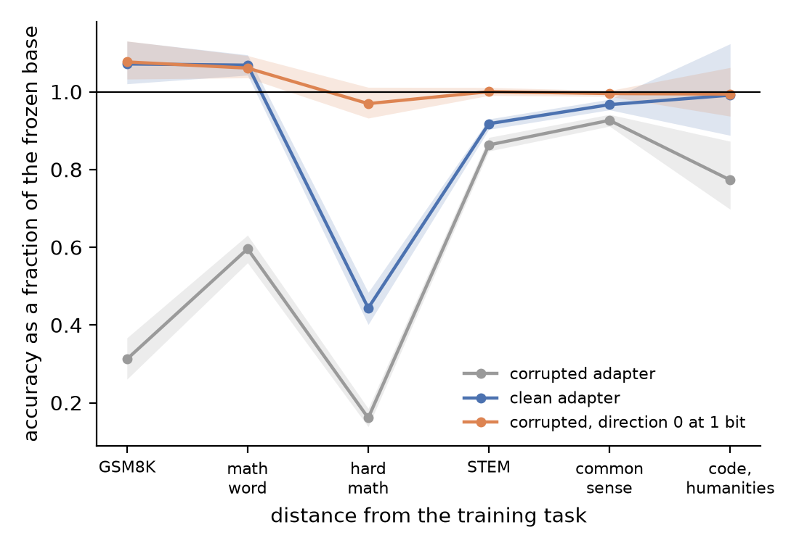
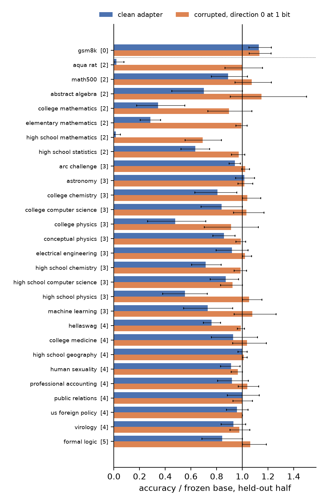
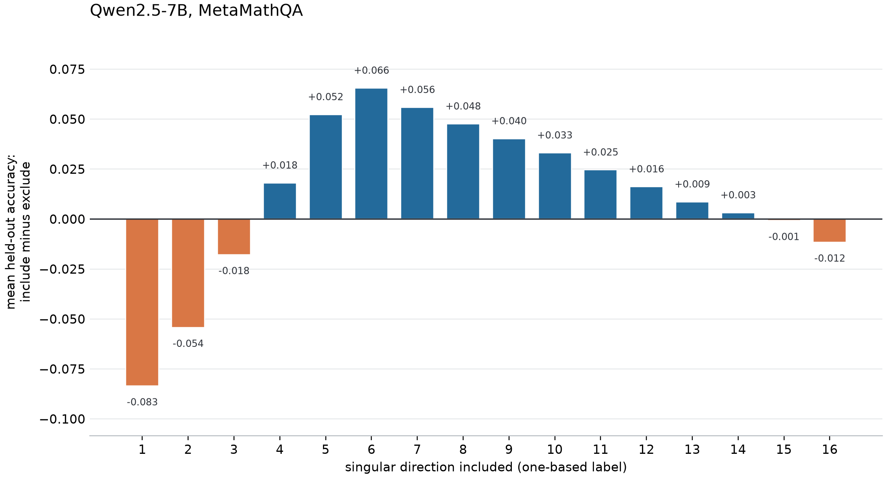

# Corruption recovery at scale: the ordering holds; coding rotates the update

One Qwen2.5-7B receiver, MetaMathQA rank-16 LoRA, matched clean and
permuted-rationale arms, a 131-cell band-and-codec grid chosen on reserved
clean training rows, then seven frozen probes. Every number below is from
`.cache/reports/spectral_scale_v1`, jobs 42906-42939 on Jean-Zay.

## What the scale-up fixed

The Mistral-7B/GSM8K pilot could not ask the question: its frozen base arm hit
the generation cap on 74% of rows and scored 0.102, so "corrupted below base"
was unreachable and every spectral filter was measuring termination rather than
reasoning. Screening seven candidate receivers on fluency before score
(`screen_receivers.csv`) rejected Mistral-7B on all seven probes and
Llama-3.1-8B on five, and chose Qwen2.5-7B.

On the new receiver the corrupted adapter hits the generation cap on 0% of
search rows and emits an answer on every one. It stops correctly and answers
wrong. That is the regime the study needed.

## The ordering the study was built to find

On GSM8K, 512 rows:

| condition | accuracy |
|---|---:|
| clean_raw | 0.816 |
| coded corrupted (`band00_01_mixed1p5`, 0.40 MB) | 0.793 |
| base, no adapter | 0.756 |
| corrupted raw | 0.236 |

`corrupted < base < coded` holds at the point estimate, and the corrupted arm's
harm is enormous (-0.520 against base). But the coded-beats-base leg is not
separated from zero: +0.037, 95% CI [-0.002, +0.076]. The pre-registered gate
required the interval to exclude zero, so **`ordering_on_training_task` fails by
two thousandths of a point.** More rows would likely settle it; the frozen gate
is reported as it stands.

## Correction: the mechanism is not shrinkage

**An earlier version of this file claimed the mechanism was norm shrinkage. That
was wrong**, and it was wrong against evidence already in this study's own
search grid. The claim rested on one comparison -- a fixed 0.3x rescale of
direction 0 scoring 0.844, above the coded winner -- and on never running the
norm-matched control the codebase already implements.

### What the search grid actually shows

Truncating to rank r and coding at b bits (`search_grid.csv`, 128 held-out rows):

| rank | 1 bit | 2 bits | 4 bits | 16 bits |
|---:|---:|---:|---:|---:|
| 1 | **80** | 52 | 45 | 45 |
| 2 | 64 | 44 | 41 | 39 |
| 4 | 59 | 41 | 45 | 43 |
| 8 | 52 | 45 | 42 | 43 |
| 16 | 48 | 45 | 42 | -- |

The damaged reference on these rows is 42. Every cell at two bits or more sits
on that floor. The one-bit column does not, and it climbs as rank falls. The
decisive pair is within a single row: **rank 1 at 16 bits scores 45, rank 1 at
one bit scores 80.** Identical rank, identical band, identical truncation. A
35-point gap produced by bit depth alone. No account in terms of rank or
magnitude can produce that difference, because neither quantity changes
between those two cells.

This reproduces the recorded grid, which on GSM8K gives 39 and 80 for the same
two cells against a damaged floor of 23.

### Why: coarse coding moves the update, it does not shrink it

`coded_band_geometry.py` codes the rank-1 band of the permuted adapter and
measures it against the fp16 band it came from. If coding were a rescale, the
two would be collinear and a single scalar would fit one to the other exactly.

| code | norm ratio | cosine to fp16 band | residual after best scalar fit |
|---|---:|---:|---:|
| binary (1 bit) | 0.635 | 0.635 | **0.772** |
| mixed 1.5-bit | 0.635 | 0.635 | 0.772 |
| two-bit | 0.880 | 0.880 | 0.475 |
| four-bit | 0.983 | 0.983 | 0.184 |
| eight-bit | 1.000 | 0.9999 | 0.013 |

The binary-coded rank-1 band sits **50.6 degrees away** from the fp16 rank-1
band: 77% of its magnitude lies outside the span of the update it was coded
from. It is not reachable by rescaling at any magnitude. The rotation shrinks
monotonically with bit depth until eight-bit coding is effectively lossless.

`cosine == norm ratio` exactly in every row. That is the orthogonality
condition of a least-squares optimal quantizer -- the coding error is
orthogonal to the reconstruction -- so residual = sqrt(1 - cosine^2) and the
rotation *is* the compression, not an artefact of it.

Shrinkage remains *sufficient*: turning the update down does recover accuracy,
which is why the 0.3x rescale scores well. The recorded study settles what
coding adds on top, at matched update norm (ratio 1.000000): the coded cell
still wins at 1, 2, 4 and 8 bits by **+2.4, +7.2, +3.0, +1.8**, three of four
excluding zero. Both facts are true; collapsing them into "the mechanism is
shrinkage" was the error.

### Where the damage lives

Independently of coding, the corruption is concentrated in the leading
directions. At full precision, every band that *includes* singular direction 0
stays pinned near the damaged level -- [0,1) 0.453, [0,2) 0.391, [0,4) 0.430,
[0,8) 0.430, [0,12) 0.406, against a damaged reference of 0.422 -- while every
band that *excludes* it rises: [1,2) 0.625, [2,4) 0.695, [4,12) 0.680,
[4,16) 0.734.

## Both transfer claims fail, and the reason matters

`transfer_table.csv` carries the full seven-probe panel.

**Dataset agnosticism fails**: the gate needed the coded adapter to beat base on
three of four sibling math corpora; it managed two. SVAMP +0.063
[+0.020,+0.110] and ASDiv +0.037 [+0.010,+0.062] pass. GSM-Symbolic is +0.002
and MATH-500 is -0.020, both intervals spanning zero.

**Task specificity fails**: the coded adapter beats base on HumanEval by +0.079
[+0.024,+0.140]. A recovered *math* program should not improve Python.

The deeper problem is visible in the clean arm, before compression enters at
all. The clean MetaMathQA adapter against base:

| dataset | family | clean - base | 95% CI |
|---|---|---:|---|
| gsm8k | training_task | +0.061 | [+0.023, +0.100] |
| svamp | math | +0.073 | [+0.030, +0.117] |
| asdiv | math | +0.061 | [+0.035, +0.086] |
| gsm_symbolic | math | +0.061 | [+0.021, +0.100] |
| **humaneval** | **code** | **+0.091** | [+0.006, +0.177] |
| **math500** | **math** | **-0.084** | [-0.132, -0.038] |
| arc_challenge | mc_science | -0.027 | [-0.049, -0.006] |

Training on math word problems helps Python code generation *more* than it
helps GSM8K, and significantly hurts MATH-500. The intervention was never
task-specific, so no compression of it could be shown to be. And the "math
family" is not one family: MATH-500 moves opposite to the other four.

The corrupted arm says the same thing from the other side. It does not damage
math selectively -- it wipes out ARC-Challenge, a multiple-choice science task
with no rationales in it, from 0.873 to 0.078. The corruption is a general
capability wipeout, and compression is a general repair back toward base.

## Breadth panel: what compression keeps and the clean adapter spreads

`spectral_breadth_v1`, restored original Qwen2.5-7B adapters (seed 11, rank 16),
72 probes in six distance tiers from GSM8K outward. The compressed arm is the
band_codec winner selected on reserved MetaMathQA rows: direction 0 alone at
1 bit (`band00_01_binary`). Whether the clean adapter hurts a probe is decided
on the first half of its rows (a loss of at least 5% of base); the comparison
uses the second half. Tiers average family by family, so MMLU subjects do not
outvote the other probes; the 78 questions shared by two MMLU subjects are
scored once. `breadth_panel.py` produces everything below.

Fraction of frozen-base accuracy, family-weighted, 95% row-bootstrap interval:

| tier | contents | clean | compressed | corrupted |
|---|---|---:|---:|---:|
| 0 | GSM8K | 1.07 [1.02, 1.13] | 1.08 [1.03, 1.13] | 0.31 |
| 1 | SVAMP, ASDiv, GSM-Symbolic | 1.07 [1.04, 1.10] | 1.06 [1.04, 1.09] | 0.60 |
| 2 | MATH-500, AQuA, MMLU math | **0.44** [0.40, 0.48] | **0.97** [0.93, 1.01] | 0.16 |
| 3 | ARC, OBQA, QASC, MMLU STEM | 0.92 [0.90, 0.93] | 1.00 [0.99, 1.01] | 0.86 |
| 4 | commonsense, reading, MMLU other | 0.97 [0.95, 0.98] | 1.00 [0.99, 1.00] | 0.93 |
| 5 | HumanEval, MMLU humanities | 0.99 [0.89, 1.12] | 0.99 [0.94, 1.06] | 0.77 |

Raw accuracy, family-weighted per tier. "Rank-1, 1 bit" is the compressed
corrupted adapter above (0.40 MB); "all 16, 1 bit" codes the whole corrupted
update at 1 bit per value, the codec-family winner:

| tier | base | clean | corrupted, rank-1, 1 bit | corrupted, all 16, 1 bit | corrupted |
|---|---:|---:|---:|---:|---:|
| 0 | 0.756 | 0.810 | 0.814 | 0.544 | 0.236 |
| 1 | 0.812 | 0.867 | 0.861 | 0.656 | 0.496 |
| 2 | 0.539 | 0.252 | 0.522 | 0.373 | 0.096 |
| 3 | 0.777 | 0.727 | 0.778 | 0.774 | 0.686 |
| 4 | 0.807 | 0.780 | 0.803 | 0.801 | 0.748 |
| 5 | 0.577 | 0.569 | 0.575 | 0.557 | 0.476 |

Coding all sixteen directions at 1 bit does not recover the training task;
the recovery needs the rank cut.

At home the compressed corrupted adapter matches the clean one (GSM8K 0.814 vs
0.810, base 0.756). Away from home the clean adapter loses and the compressed
one does not. The clean adapter hurts 27 probes on their first half; 23 of
those still hurt on the held-out half, and on it the compressed adapter beats
the clean one on 25 of 27, by +0.145 accuracy on average [+0.103, +0.193].

**Most of that gap is answer format, not knowledge.** The multiple-choice
probes ask for a letter within 32 tokens. The clean adapter answers with the
MetaMathQA habit instead -- a worked solution -- and runs out before any
letter. Where it does give a letter, it is as accurate as base:

| MC tier | no letter: clean | accuracy given a letter: base / clean / compressed |
|---|---:|---|
| 2 | 71% | 0.580 / 0.609 / 0.589 |
| 3 | 10% | 0.776 / 0.798 / 0.776 |
| 4 | 2% | 0.781 / 0.771 / 0.778 |
| 5 | 2% | 0.693 / 0.701 / 0.678 |

(Conditioning on "gave a letter" selects rows, so the middle column is
indicative, not an unbiased accuracy.) The compressed adapter never loses the
letter format beyond tier 2 (7% there). MATH-500 is the one generative
exception and it is not truncation: the clean adapter writes GSM8K-length
solutions (264 tokens against base's 513) and is worse even on the ones it
finishes (0.524 vs 0.670); the compressed adapter keeps base-length solutions
(451 tokens, 0.650).

So the finding is: the clean fine-tune installs the training corpus's output
style everywhere, and that style is what costs accuracy off-task; the
compressed corrupted adapter carries the on-task gain without exporting the
style. What it does not show is better reasoning off-task: with format factored
out, neither adapter moves knowledge-heavy probes away from base.

## The search grid on GSM8K test, where the damage shows

The search split cannot show the corruption (corrupted 0.42 vs base 0.44 on
reserved MetaMathQA rows), so every breadth-grid candidate was also scored on
all 500 GSM8K test rows after selection was frozen (`--phase map`,
`gsm8k_map.csv`). Base 0.756, clean 0.810, corrupted 0.236:

| kept directions | 1 bit | 2 bits | fp16 |
|---|---:|---:|---:|
| 0 | **0.814** | 0.682 | 0.396 |
| 0-1 | 0.802 | 0.338 | 0.236 |
| 0-3 | 0.728 | 0.250 | 0.232 |
| 0-7 | 0.618 | 0.226 | 0.226 |
| all 16 | 0.544 | 0.216 | (0.236) |
| 1 | 0.760 | 0.760 | 0.770 |
| 2-3 | 0.750 | 0.788 | 0.794 |
| 4-15 | 0.752 | 0.794 | **0.820** |

Direction 0 is the damage at full precision (0.396) and the best compressed
adapter at 1 bit (0.814, level with the clean adapter). Every extra direction
coded with it costs accuracy, and at 2 bits the leading block stays damaged.
Shrinking direction 0 alone does as well as coding it: at half its norm it
scores 0.812 (`scale_r1_0.5`), and scaling the whole update by 0.1 scores 0.810.
So at rank 1 the recovery is a magnitude effect on the leading direction, as
the recorded alpha sweep found (peak 80.8 at alpha 0.2-0.5); whether coding
adds anything at matched norm is what the controls group (queued) measures.
Without direction 0, full precision is best: directions 4-15 score 0.820.

## Matched-norm controls (breadth controls group, complete)

Does 1-bit coding direction 0 do more than shrink it? The controls rescale the
full-precision direction 0 to exactly the norm its 1-bit code has
(`norm_band_band00_01_binary`), and separately rescale the whole 16-direction
update to that norm (`norm_full_...`). Test accuracy:

| condition | GSM8K | SVAMP | MATH-500 |
|---|---:|---:|---:|
| direction 0, 1 bit (the compressed adapter) | 0.814 | 0.890 | 0.590 |
| direction 0, fp16, rescaled to the same norm | 0.786 | 0.870 | 0.550 |
| direction 0, fp16, half norm (`scale_r1_0.5`) | 0.812 | 0.853 | 0.578 |
| all 16 directions, rescaled to the same norm | 0.534 | 0.703 | 0.403 |
| corrupted, uncompressed | 0.236 | 0.593 | 0.220 |
| base | 0.756 | 0.790 | 0.585 |

Coded minus norm-matched direction 0: GSM8K +0.028 [+0.000, +0.058], SVAMP
+0.020 [-0.010, +0.050]. At matched norm the code's extra effect is small and
at the edge of significance; most of the recovery is dropping directions 1-15
and shrinking direction 0. Shrinking alone is not enough when the other
directions stay: the whole update rescaled to the same norm scores 0.534.
The clean adapter's direction 0 alone (`fixed_clean_0_1`) scores 0.822, the
whole clean gain on GSM8K.

## Every window at single-direction resolution

`spectral_regimes_fine_v1` scored all 136 contiguous windows of the rank-16
corrupted update, the 16 leave-one-out updates and six shrinkage controls on
the 128-row search split (`fine_windows.py`, `figures/R6_every_window.png`, `R6_every_window.csv`).
On this split the corrupted adapter barely differs from base (0.391 vs 0.367;
one standard error is about 0.044), so the map shows what windows add over
base, not how much damage they remove, and the leave-one-out arm is
uninformative here (every one lands at 0.36-0.41).

The structure is still plain. Every window that contains direction 0 stays at
base, whatever else it keeps: direction 0 masks the rest. Windows that start
at directions 1-5 add up to +0.27 (best [4,14) 0.641, [2,5) 0.633; direction 1
alone 0.555). Windows that start at 8 or later add little. The GSM8K test of the
finalists, where the damage is visible, is the next job in the chain.

The per-direction summary below uses the same 136 windows. For each direction,
it compares mean accuracy across every contiguous band that includes that
direction with mean accuracy across every band that excludes it. This is a
descriptive contrast across overlapping bands, not an independent causal
effect; the search split also has limited power to show the damaged adapter's
harm.

On GSM8K test, where the damage shows, the selected window settles it
(`fine_test.csv`; the window and the shrinkage control were chosen on reserved
MetaMathQA rows only). Keeping directions 4-13 of the corrupted update at full
precision -- no coding at all -- scores 0.820 against base 0.756 (+0.064
[+0.026, +0.102]), the corrupted adapter's 0.236 and the clean adapter's 0.810.
It also beats base on SVAMP (+0.050 [+0.013, +0.090]) and stays at base
elsewhere, including the two probes the clean adapter hurts (ARC-Challenge
0.876 vs clean 0.818, MMLU 0.704 vs clean 0.634). Removing the leading
directions is enough; coarse coding is one way of doing it, not the cause.

## Replication: Gemma-2-9B-it on NuminaMath-CoT (every window)

`regimes_gemma_v1` (configs/regimes_gemma.yaml): a second family and a second
corpus, both adapters trained here (24k NuminaMath-CoT rows, rank 16, the
permuted arm with each solution's working swapped for another problem's).
Search split: 128 reserved NuminaMath rows, scored like MATH. Here the damage
is visible on the search split, unlike Qwen's: base 0.383, clean 0.438,
corrupted 0.180. `figures/R6b_every_window_gemma.png`,
`R6b_every_window_gemma.csv`.

- Dropping direction 0 alone restores base (0.383). Dropping any other single
  direction leaves the damage (0.16-0.22): direction 0 carries all of it.
- Every window that contains direction 0 is damaged (mean 0.214); windows that
  start at directions 1-5 sit at base (mean 0.385).
- The best band, directions 1-8, scores 0.477: above base (+0.094) and above
  the clean adapter (+0.039), at full precision and without direction 0.

The Qwen-7B finding -- the corruption lives in the leading direction and the
band just below it carries a usable gain -- holds on a different family and a
different corpus. The test of the selected band on MATH-500 is the
next job in the chain.

## Replication at 14B: Qwen2.5-14B (every window)

`regimes_qwen14b_v1` (configs/regimes_qwen14b.yaml): the corrupted arm is the
scale ladder's 14B adapter, the clean arm trained here with the same recipe.
Search split as for 7B (128 reserved MetaMathQA rows): base 0.547, clean
0.680, corrupted 0.461. `figures/R6c_every_window_qwen14b.png`,
`R6c_every_window_qwen14b.csv`. Run on A100.

- The damage is broader than at 7B or in Gemma. Every window containing
  direction 0 is damaged (mean 0.435), and direction 1 is damaging together
  with the tail: alone it scores 0.680, but directions 1-15 score 0.461.
  Dropping direction 0 alone does not restore base (0.469).
- The band below is stronger than at 7B. Windows starting at directions 2-7
  sit up to +0.17 above base; the best, directions 3-5, scores 0.719 --
  above base (+0.172) and above the clean adapter (+0.039). Directions 4-15
  score 0.648.

This is the scale at which 1-bit coding stopped beating base (T3: -2.2 at
14B), and the pass band still beats it clearly. The selected band
(`band03_06_fp16`) was then tested.

The test (`summary_core.json`) settles it: on all 500 GSM8K test rows the
selected band, directions 3-5 at full precision, scores 0.878 against base
0.830 (+0.048 [+0.018, +0.078]), clean 0.836 (+0.042 [+0.010, +0.076]) and
corrupted 0.376, and it holds base on the off-task probes where the clean
adapter loses (MMLU 0.768 vs clean 0.742, ARC-Challenge 0.924 vs 0.906).

## Replication at 32B: Qwen2.5-32B (every window)

`regimes_qwen32b_v1`: the scale ladder's 32B corrupted adapter, clean arm
trained here (174 min). Search split: base 0.586, clean 0.719, corrupted 0.523.
`figures/R6d_every_window_qwen32b.png`, `R6d_every_window_qwen32b.csv`. Run on H100.

- The damage is back in direction 0 alone, as at 7B and in Gemma. Direction 0
  by itself scores 0.44, below the whole corrupted adapter. Dropping only
  direction 0 gives 0.66 (+0.07 over base); dropping any other single
  direction leaves the damage (0.51-0.53).
- Every other direction carries gain: each one alone scores 0.63-0.70, above
  base. Windows containing direction 0 average 0.504; windows starting at 1-5
  average 0.668; the best reach 0.72, level with the clean adapter.

At 32B, where 1-bit coding scored 4.2 points below base (T3), removing one
direction recovers the model to near the clean adapter.

On the 500-row GSM8K test (half of the probe panel still running at 08:00) the
selected band, directions 3-4 at full precision, scores 0.910: exactly base
(0.910, [-0.018, +0.020]) and above the clean adapter, which hurts GSM8K at this
size (0.850; band minus clean +0.060 [+0.032, +0.090]); corrupted 0.396. At 32B
the base model is already strong enough that the band restores it but does not
beat it.

## What each direction contributes, across four models

`plot_band_contribution.py` averages the window grids: for each singular
direction, mean accuracy of the windows that include it minus the windows that
exclude it. `figures/R7_all_per_direction_contribution.pdf` stacks Qwen2.5-7B,
14B, 32B and Gemma-2-9B (single-model versions R7, R7c, R7d, R7b; values in
`R7*_per_direction_contribution.csv`). Direction 1 (the leading direction) is
the most harmful in all four: -0.083 at 7B, -0.162 at 14B, -0.167 at 32B,
-0.170 in Gemma.

Because windows are contiguous, a window containing direction k that starts
at direction 1 also contains direction 1, so the plain contrast charges early
directions with direction 1's damage. `R7_all_..._without_direction1.pdf`
repeats it over windows that leave direction 1 out. There the 32B bars for
directions 3-16 are flat (within 0.006) -- consistent with each of them
scoring above base on its own -- Gemma's directions 2-9 are mildly positive,
7B keeps its mid-band peak (+0.08 at direction 6), and at 14B direction 2
stays harmful (-0.065), the one model where the damage reaches past the
leading direction.

## A likelihood predictor for choosing the compression

`--phase likelihood` scores each candidate update, after band selection and
coding, by the teacher-forced bits per token it assigns to reference answers.
It generates nothing. Rows are disjoint from the outcome it predicts: the
selection split for the training task (outcome: search-split accuracy), the
first half of each probe (outcome: the second half). `likelihood_predictor.py`
scores it.

On the training task it works. Across the 53 search candidates, Spearman
correlation with measured accuracy is 0.84; the update-norm baseline gets
0.37. Among corrupted-adapter candidates its first choice (`scale_r1_0.5`,
0.680) is the measured best, so regret is zero.

The fine sweep replicates this on 160 candidates, all fp16 windows,
leave-one-outs and shrinkage: Spearman 0.87 against 0.02 for update norm, and
the same zero-regret first choice among corrupted-adapter candidates.

Off-task it is weak. It says the clean adapter is worse than base on 69 of 72
probes, including all 27 where accuracy confirms it -- the letter-token
likelihood charges the clean adapter for its format on every multiple-choice
probe, whether or not that format costs answers there. It picks the better of
clean and compressed on 49 of 65 probes. For the compressed adapter, which
stays close to base everywhere, it has no signal (Spearman 0.00 across probes).
A fix would score multiple choice with the probability of the right letter
among the letters rather than of the letter itself.

## Generalization replication: Gemma-2-9B-it on NuminaMath-CoT

`generalization_gemma_v1` (configs/generalization_gemma.yaml): the same 72-probe
panel, re-tiered around MATH-500 as home. Both adapters trained here. The
compressed arm is the band_codec winner chosen on reserved NuminaMath rows:
directions 0-7 at 1 bit (`band00_08_binary`). HumanEval is dropped (Gemma-it
scores 0 because the harness does not strip its code fences), leaving 71
probes. `breadth_panel.py generalization_gemma_v1 ...`,
`generalization_gemma.csv`, `generalization_gemma_summary.json`,
`figures/B1b_...`, `figures/B2b_...`.

Fraction of base, family-weighted:

| tier | clean | compressed corrupted | corrupted |
|---|---:|---:|---:|
| 0 MATH-500 | 1.00 | 1.04 | 0.35 |
| 1 hard / MC math | 0.19 | 1.01 | 0.01 |
| 2 math word | 0.95 | 1.01 | 0.48 |
| 3 STEM | 0.87 | 1.01 | 0.49 |
| 4 commonsense | 0.84 | 1.00 | 0.50 |
| 5 humanities | 0.88 | 1.00 | 0.33 |

The clean adapter hurts 36 probes on their first half; on the held-out half
the compressed corrupted adapter beats it on 35, by +0.179 [+0.139, +0.224].
As for Qwen, most of the clean adapter's loss is answer format: on the
multiple-choice probes it gives no letter on 18% of rows on average (up to
94% on MC math), the compressed adapter on 0.1%.

At home the ordering holds but the margin is small: MATH-500 corrupted 0.180
< base 0.510 <= compressed 0.528 (+0.018 [-0.016, +0.054]); the clean adapter
does not beat base there at all (0.508). Where it clearly beats base and the
clean adapter falls below base is a close task: ASDiv, compressed 0.922 vs
base 0.892 (+0.030 [+0.007, +0.052]) vs clean 0.868; SVAMP +0.026
[+0.000, +0.057]; MMLU high-school chemistry +0.034 [+0.010, +0.059] vs clean
0.453. On GSM8K the compressed adapter holds base (0.858 vs 0.877, n.s.) while
the clean one drops to 0.790.

## What can and cannot be claimed

Can: on this receiver and corpus, a rationale-permuted adapter is catastrophically
harmful across every task tested, and reducing the magnitude of its single
dominant singular direction restores base-level behaviour and slightly better.
The damage localises to direction 0.

Cannot: that any of this is task-specific, in either the clean or the coded
adapter. The transfer panel below refutes that separately, and it is the part
of this study that stands as a negative result.

## Limits

One receiver, one seed, one corpus, one rank. The GSM8K interval is marginal.
The norm-matched controls (`--group controls`) are running as jobs 44616-44619
and the from-scratch low-rank arms as job array 44721; until they land, the
matched-norm claim quoted above is the recorded study's, not this run's. The
geometry measurement is exact and needs no evaluation.

## Files

| file | contents |
|---|---|
| `screen_receivers.csv` | 7 candidate models x 7 probes, fluency and score verdicts |
| `search_grid.csv` | all 134 search cells: band, bits, accuracy, file size, update norm |
| `transfer_table.csv` | 7 probes x 7 frozen conditions, test accuracy |
| `paired_contrasts.csv` | paired bootstrap intervals for the five contrasts that matter |
| `breadth_panel.py` | breadth-panel analysis: split-half selection, tier curves, figures B1-B2 |
| `breadth_panel.csv` | 72 probes: accuracy per arm, held-out-half fractions of base with CIs, no-answer rates |
| `breadth_panel_summary.json` | hurt counts, compressed-minus-clean gap, tier curves with intervals |
| `fine_windows.py`, `R6_every_window.csv`, `R6b_every_window_gemma.csv`, `R6c_every_window_qwen14b.csv`, `R6d_every_window_qwen32b.csv` | all 136 windows and 16 leave-one-outs on the search split; figures R6 (Qwen2.5-7B), R6b (Gemma-2-9B), R6c (Qwen2.5-14B), R6d (Qwen2.5-32B) |
| `plot_band_contribution.py`, `per_direction_band_contribution.csv` | include-versus-exclude mean accuracy contrast across the 136 contiguous windows; figure R7 |
| `fine_test.csv` | fine-sweep finalists on the eight test probes, with the window-vs-base interval |
| `likelihood_predictor.py` | scores the likelihood predictor against search and held-out probe accuracy |
| `coded_band_geometry.py` | codes the rank-1 band and measures norm, cosine and scalar-fit residual against the fp16 band |
