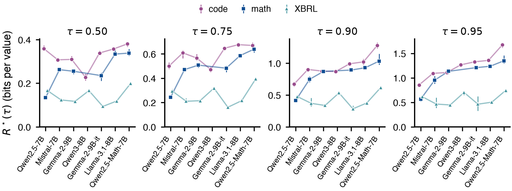

# Does the receiver panel depend on the 90% threshold?

A reviewer can ask whether R*(0.90) is a convenient choice. This recomputes R*
at retention targets 0.50, 0.75, 0.90 and 0.95 from the codec ladders already
recorded for the transposed receiver panel (Figure 6b): 60 checkpoints, seven
receivers, three corpora, three seeds. No model was rerun. The reference is the
paper's (the best of the raw and decoded gains), and the 0.90 crossings
reproduce the recorded R* exactly. Every crossing is bracketed at every target.

The corpus-level claims of Figure 6(b) hold at all four targets. XBRL tagging
is the cheapest corpus on the same six receivers, Qwen2.5-7B is the one
exception at every target (math is cheaper there), and math costs Qwen2.5-Math-7B
about 2.5 times what it costs Qwen2.5-7B:

| target | XBRL cheapest on | exception | math, Qwen2.5-Math / Qwen2.5 |
|---|---|---|---|
| 0.50 | 6 of 7 receivers | Qwen2.5-7B (math) | 2.53 |
| 0.75 | 6 of 7 | Qwen2.5-7B (math) | 2.63 |
| 0.90 | 6 of 7 | Qwen2.5-7B (math) | 2.49 |
| 0.95 | 6 of 7 | Qwen2.5-7B (math) | 2.39 |

The finer claim, how receivers rank within one corpus, does depend on the
target. Kendall's tau-b between each target's receiver order and the 0.90 order:

| target | code | math | XBRL |
|---|---|---|---|
| 0.50 | 0.43 | 0.60 | 0.81 |
| 0.75 | 0.81 | 0.87 | 0.90 |
| 0.95 | 0.71 | 1.00 | 0.90 |

The retention curves cross. The clearest case is Qwen2.5-7B on code: the
cheapest receiver at 0.90 (0.67 bits per value), sixth of seven at 0.50 (0.36).
Its code adapter needs more bits than most receivers' to keep half its gain,
and fewer than any to keep 90%.

In practice: the paper can cite this as robustness for the receiver-relative
claim and the corpus ordering, but a statement that ranks receivers within a
corpus should name the target, and should not be read as holding at low
retention.

Corpora as in Figure 6(b), receivers in their 0.90 order; markers are seed
means and bars span the three seeds.

| File | Contents |
|---|---|
| `thresholds.csv` | One row per checkpoint and target: R*, bracketed |
| `receiver_means.csv` | Seed mean, min and max per receiver, corpus and target |
| `summary.json` | The checks above, as computed |
| `retention_threshold.pdf` | Vector figure; `.png` is a preview |

Reproduce with `uv run python scripts/analysis/retention_threshold.py`, which
reads the panel's ladders from `.cache/runs` (pulled run metadata, not tracked).
