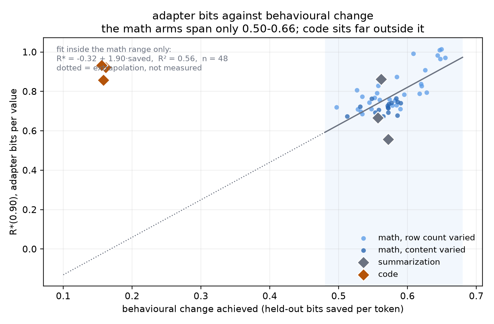

# What sets the adapter bit budget

**Status: partial.** Four of five planned axes have landed. The behavioural
transform grid ran but its numbers are invalid pending a baseline fix, described
at the bottom. Nothing here is a finished claim.

Recorded 2026-08-21. Mistral-7B-v0.1 on an NF4 base, all-linear LoRA, every arm
compute-matched at 2,000 optimizer updates and 32,000 samples seen. R*(0.90) is
the smallest adapter file retaining 90% of the best gain the code family
reaches, on held-out bits saved.

## 1. Content moves the budget at a fixed row count

The original question. Eight thousand rows in every arm; only the number of
distinct MetaMathQA seed problems behind them changes. Six seeds.

| distinct source problems | R\* bits/value | seed range | bits saved/token |
|---|---:|---|---:|
| 400 | 0.682 | 0.673–0.706 | 0.550 |
| 1,200 | 0.713 | 0.678–0.737 | 0.568 |
| 3,600 | 0.746 | 0.716–0.765 | 0.576 |
| ~5,620 | 0.742 | 0.711–0.784 | 0.579 |

Monotone, and the 400 and 3,600 seed ranges do not overlap. Adapter bits track
content, not merely row count. This is the result Experiment 2 could not
establish, because its arms were nested draws in which the two moved together.

## 2. Most of that runs through behavioural change

Pooling all rank-16 math arms, duplication and diversity together, 48 runs:

    R* = -0.32 + 1.90 x (held-out bits saved per token),  R2 = 0.56

Every math arm sits within ±0.09 bits per value of that line. So the diversity
lever moves R\* largely *by* producing a larger behavioural change rather than
in addition to it.

**This is weaker than it looks.** The math arms span only 0.50 to 0.66 bits
saved per token. A slope fitted inside a range that narrow, then extrapolated
three times beyond it, is not a curve. It is a cluster with a line through it.

## 3. The kind of change matters

Residuals against that fit:

| arm | bits saved/token | residual, bits/value |
|---|---:|---:|
| eight math arms | 0.53–0.64 | −0.046 to +0.089 |
| summarization (XSum) | 0.564 | −0.057 |
| **code (Magicoder)** | **0.159** | **+0.923** |

Code produces a small behavioural change and still needs 0.90 bits per value.
Summarization lands on the math line. Both arms are properly bracketed with
smooth retention curves, so the code figure is a real crossing rather than a
censored one.

Caveats, and they are not small: three seeds each; the code fine-tune is weak
(HumanEval pass@1 of 0.03 to 0.11 across seeds, with Magicoder truncated at
1,024 tokens to keep the protocol matched); and XSum's own seed range is 0.557
to 0.862, wider than the entire diversity effect.

## 4. The level is mostly the container

| arm | rank 16 | rank 64 | ratio |
|---|---:|---:|---:|
| 8k rows, 400 problems | 28.6 Mbit | 82.7 Mbit | 2.9× |
| 32k rows | 41.4 Mbit | 129.3 Mbit | 3.1× |

R\* as a whole file. Quadrupling the rank roughly triples the file needed. If
the adapter were storing task content the total would be flat; if it were pure
addressing cost it would scale fourfold. Three is much closer to addressing.

## 5. Where the bits live

Layer bands coded at different rates under a matched total budget, on adapters
that already existed — no training.

| budget | uniform | early third starved | middle starved | late starved |
|---|---:|---:|---:|---:|
| 0.5 bits/value | **0.800** | 0.778 | 0.756 | 0.707 |
| 1.0 bits/value | **0.966** | 0.959 | 0.906 | 0.896 |

Fraction of the gain retained. Uniform wins at both budgets, and starving the
late third costs most. Meanwhile the weight update is almost exactly even
across bands (RMS 0.00579 / 0.00577 / 0.00577) while the representational shift
grows monotonically with depth, from 0.00 at the embedding to 0.43 at the last
layer.

So training moves every layer about equally, the effect compounds with depth,
and no band is dispensable. This repeats Experiment 1's negative on a new axis:
allocating bits by structure does not beat spreading them evenly.

## What is missing

The behavioural transform grid — five response rewrites at two diversity levels,
30 runs — completed but cannot be read yet. Baselines are keyed on the
evaluation, so all thirty shared one baseline per seed, while each transform
rewrites its own calibration split: 57,958 held-out tokens for `symbolic`
against 48,664 for `plain`. Bits saved was subtracting a measurement taken on
one held-out set from another. `_baseline_key` now forks on the transform, and
the base side is being remeasured on each transform's own calibration split.
Each codec metric already stores its own held-out bits, so the recomputation is
offline and needs no retraining.

That grid is what would widen the behavioural range in section 2 from 0.16 bits
per token to something a curve can be fitted in.

## Files

| file | contents |
|---|---|
| `arms.csv` | 59 runs: study, rank, seed, bits saved, R\* in bits per value and Mbit |
| `layer_allocation.csv` | 40 rows: every placement at every budget, retained gain |
| `representation_shift.csv` | 165 rows: per-layer hidden-state shift and cosine |
| `content_and_rows.png` | R\* against content at fixed rows, and against rows |
| `collapse_and_kinds.png` | R\* against behavioural change, with code and summarization |
| `rank_scaling.png` | R\* as a whole file at rank 16 and 64 |
| `where_the_bits_live.png` | layer allocation and the depth profile |
