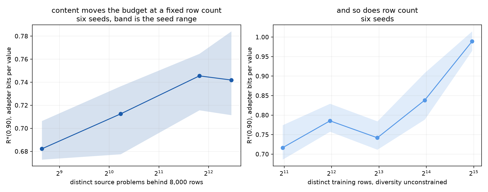
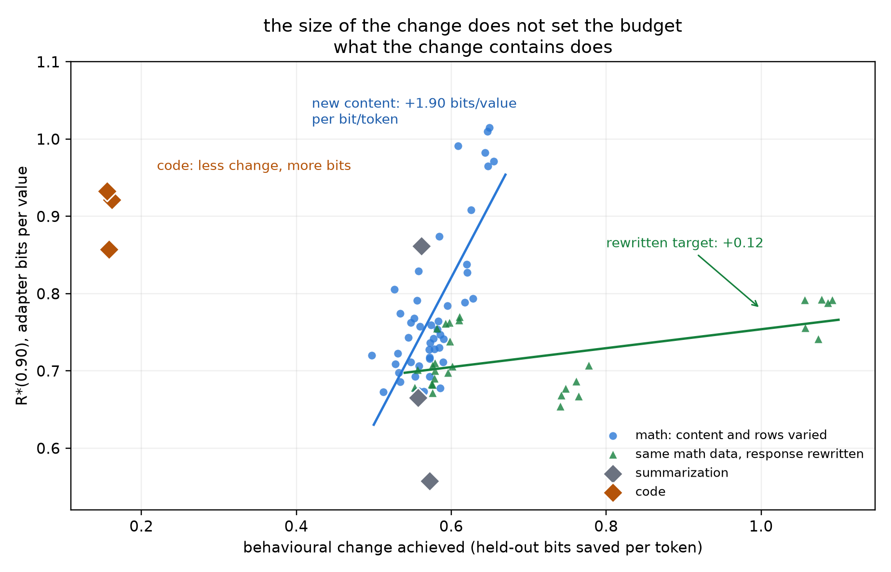
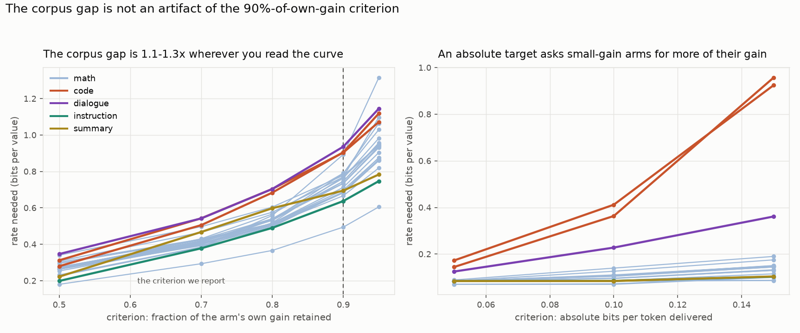
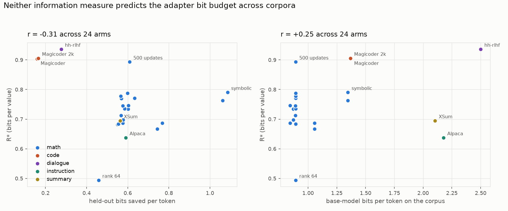
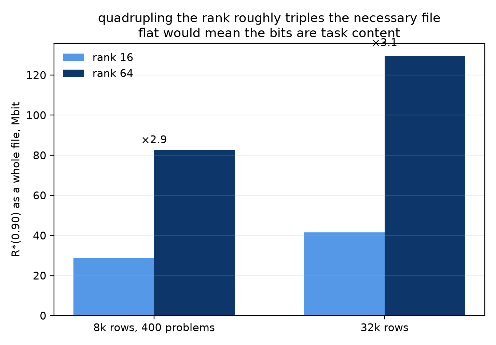
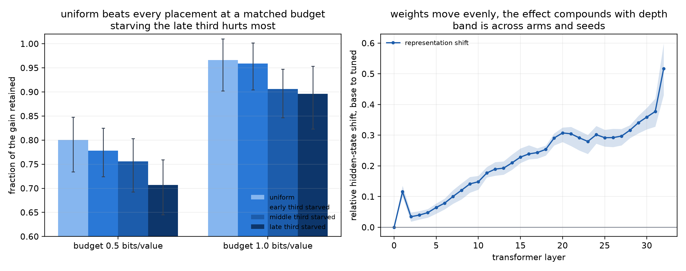

# What sets the adapter bit budget

**Status: all five axes landed, plus three corpora.** The headline changed
under the last two: the behavioural-change curve in section 2 does not survive
being tested outside the range it was fitted in.

Recorded 2026-08-21, extended 2026-08-22. Mistral-7B-v0.1 on an NF4 base,
all-linear LoRA. Every arm is compute-matched at 2,000 optimizer updates and
32,000 samples seen except the budget sweep in section 2, where the update
count is the axis. R*(0.90) is
the smallest adapter file retaining 90% of the best gain the code family
reaches, on held-out bits saved.

## 1. Content moves the budget at a fixed row count

The original question. Eight thousand rows in every arm; only the number of
distinct MetaMathQA seed problems behind them changes. Six seeds.

| distinct source problems | R\* bits/value | seed range | bits saved/token |
|---|---:|---|---:|
| 400 | 0.682 | 0.673–0.706 | 0.550 |
| 1,200 | 0.713 | 0.678–0.737 | 0.568 |
| 3,600 | 0.746 | 0.716–0.765 | 0.576 |
| ~5,620 | 0.742 | 0.711–0.784 | 0.579 |

Monotone, and the 400 and 3,600 seed ranges do not overlap. Adapter bits track
content, not merely row count. This is the result Experiment 2 could not
establish, because its arms were nested draws in which the two moved together.

## 2. It does not run through behavioural change

The first reading of these arms was a curve. Pooling 48 rank-16 math runs gave

    R* = -0.32 + 1.90 x (held-out bits saved per token),  R2 = 0.56

fitted inside a window 0.16 bits per token wide. Two axes built to widen that
window both break it.

**Response transforms.** Five deterministic rewrites of the same 8,000 answers,
each keeping the final answer line, at two diversity levels. Thirty runs. They
double the behavioural change and barely move the budget:

| transform | bits saved/token | R\* bits/value |
|---|---:|---:|
| plain | 0.555 | 0.684 |
| shouted | 0.576 | 0.687 |
| numbered | 0.577 | 0.698 |
| preamble | 0.744 | 0.667 |
| symbolic | 1.062 | 0.763 |

Narrow arms shown. Fitted over all ten transform arms the slope is **+0.12**
bits per value per bit per token, R2 = 0.37, against 1.90 for the math content
axis. `preamble` is the clean counterexample: more behavioural change than
`plain` and *fewer* adapter bits.

**Optimizer budget.** The same 8,000 rows trained for 500, 1,000, 4,000 and
8,000 updates. Content is identical across arms by construction, so nothing new
can enter; only the size of the change varies.

| updates | bits saved/token | R\* bits/value | seed sd |
|---|---:|---:|---:|
| 500 | 0.610 | 0.893 | 0.050 |
| 1,000 | 0.599 | 0.788 | 0.037 |
| 4,000 | 0.569 | 0.770 | 0.052 |
| 8,000 | 0.566 | 0.778 | 0.064 |

Sixteen times the optimization moves bits saved by 0.04 and moves R\* *down*.
Whatever sets the budget, it is not how far the model travelled.

Pooling all 24 arms in this report, the slope is **−0.14** with R2 = 0.09.
There is no single curve.

## 3. The corpus sets it, and none of our measures predict which

Three corpora were added to test the range from outside math: Anthropic
hh-rlhf (assistant dialogue), Alpaca (instruction following), Magicoder at both
1,024 and 2,048 tokens.

| arm | base bits/token | bits saved/token | R\* bits/value |
|---|---:|---:|---:|
| Alpaca | 2.178 | 0.591 | 0.638 |
| XSum | 2.104 | 0.564 | 0.695 |
| math, 19 arms | 0.84–1.35 | 0.46–1.09 | 0.49–0.89 |
| Magicoder 1k | 1.369 | 0.159 | 0.904 |
| Magicoder 2k | 1.369 | 0.165 | 0.906 |
| hh-rlhf | 2.501 | 0.277 | 0.936 |

Magicoder and hh-rlhf take the most bits per value in the whole report while
saving a third to a half of what every other arm saves. Alpaca is their mirror:
math-level bits saved, the cheapest adapter measured. Across all 24 arms R\*
correlates −0.31 with held-out bits saved and +0.25 with the base model's own
bits per token on the corpus. Neither measure predicts the budget.

**The size of that gap depends on where you read the curve; its direction does
not.** R\* is the rate retaining 90% of each arm's *own* gain, and code's gain
is 0.159 bits per token against 0.58 for math, so a fixed fraction asks the
small-gain arms for a much smaller absolute improvement. Rescoring the same
rungs at other criteria:

| criterion | math range | code | hh-rlhf | ratio to math mean |
|---|---|---:|---:|---:|
| 50% of own gain | 0.180–0.340 | 0.296 | 0.347 | 1.11× / 1.30× |
| 70% | 0.293–0.497 | 0.524 | 0.542 | 1.28× / 1.32× |
| 90% | 0.494–0.893 | 0.905 | 0.936 | 1.24× / 1.29× |
| 95% | 0.605–1.315 | 1.095 | 1.145 | 1.17× / 1.22× |

Stable, so the corpus effect is not manufactured by the 0.90 choice. But it is
a 1.1 to 1.3× effect against the math *mean*, and at every criterion code and
dialogue overlap the top of the math range rather than sitting outside it.
"Code needs the largest adapter in the campaign" is true at 90% by one per cent
over the most expensive math arm; "code costs about a quarter more than a
typical math arm, at any criterion" is the claim the data supports.

Doubling Magicoder's sequence length changes nothing (0.904 to 0.906), so the
code residual is not an artefact of truncating solutions, which was the
standing suspicion.

## 4. The level is mostly the container

| arm | rank 16 | rank 64 | ratio |
|---|---:|---:|---:|
| 8k rows, 400 problems | 28.6 Mbit | 82.7 Mbit | 2.9× |
| 32k rows | 41.4 Mbit | 129.3 Mbit | 3.1× |

R\* as a whole file. Quadrupling the rank roughly triples the file needed. If
the adapter were storing task content the total would be flat; if it were pure
addressing cost it would scale fourfold. Three is much closer to addressing.

## 5. Where the bits live

Layer bands coded at different rates under a matched total budget, on adapters
that already existed — no training.

| budget | uniform | early third starved | middle starved | late starved |
|---|---:|---:|---:|---:|
| 0.5 bits/value | **0.800** | 0.778 | 0.756 | 0.707 |
| 1.0 bits/value | **0.966** | 0.959 | 0.906 | 0.896 |

Fraction of the gain retained. Uniform wins at both budgets, and starving the
late third costs most. Meanwhile the weight update is almost exactly even
across bands (RMS 0.00579 / 0.00577 / 0.00577) while the representational shift
grows monotonically with depth, from 0.00 at the embedding to 0.43 at the last
layer.

So training moves every layer about equally, the effect compounds with depth,
and no band is dispensable. This repeats Experiment 1's negative on a new axis:
allocating bits by structure does not beat spreading them evenly.

## What is missing

A measure that predicts R\* across corpora. Held-out bits saved works inside a
corpus and fails between them; the base model's own bits per token on the
corpus does not work at all. The three arms that break every fit — code twice
and dialogue — share a property no current measure captures: their surface form
is one a base model almost never emits, while Alpaca's and XSum's are not.

Everything here is one model. A Qwen2.5-7B replication of the corpus table is
the next thing that would make any of it a claim.

## Files

| file | contents |
|---|---|
| `arms.csv` | 59 runs: study, rank, seed, bits saved, R\* in bits per value and Mbit |
| `layer_allocation.csv` | 40 rows: every placement at every budget, retained gain |
| `representation_shift.csv` | 165 rows: per-layer hidden-state shift and cosine |
| `content_and_rows.png` | R\* against content at fixed rows, and against rows |
| `collapse_and_kinds.png` | R\* against behavioural change, with code and summarization |
| `rank_scaling.png` | R\* as a whole file at rank 16 and 64 |
| `where_the_bits_live.png` | layer allocation and the depth profile |
| `transform_arms.csv` | 30 runs: transform, diversity, per-transform baseline, R\* |
| `corpus_arms.csv` | all 24 arms pooled: corpus, base bits, bits saved, R\* |
| `change_size_vs_content.png` | the transform axis against the content axis |
| `no_single_curve.png` | R\* against both information measures, five corpora |
| `criterion_sweep.csv` | every arm rescored at five fractional and three absolute criteria |
| `criterion_dependence.png` | how much of the corpus gap the 90% criterion creates |
